# OctoPrint API for Slicer Integration

## Overview

PrintFarmer implements a **minimal OctoPrint-compatible API** that allows popular slicers (PrusaSlicer, OrcaSlicer, SuperSlicer) to upload G-code files directly to PrintFarmer. This eliminates manual file transfer and integrates seamlessly into existing slicer workflows.

> **Note**: This is different from OctoPrint *backend* support. This feature makes PrintFarmer act as an OctoPrint *server* for slicers, not connect to OctoPrint printers.

## Architecture

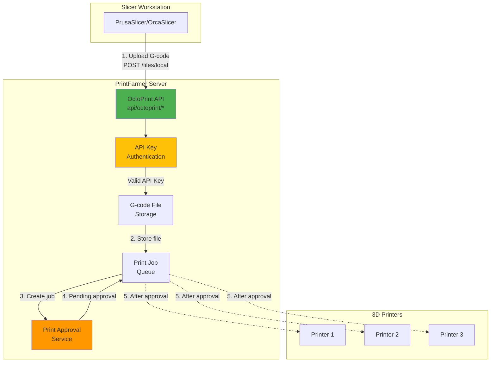

## API Endpoints

PrintFarmer implements **only the essential endpoints** required by slicers:

| Endpoint | Method | Auth | Purpose |
|----------|--------|------|---------|
| `/api/octoprint/version` | GET | Optional | Version check (slicers verify compatibility) |
| `/api/octoprint/server` | GET | Optional | Server status |
| `/api/octoprint/files/local` | POST | **Required** | Upload G-code file |

### Why minimal?

Slicers only need these three endpoints to function. File management (listing, deleting) is better handled through PrintFarmer's web UI.

## Authentication Flow

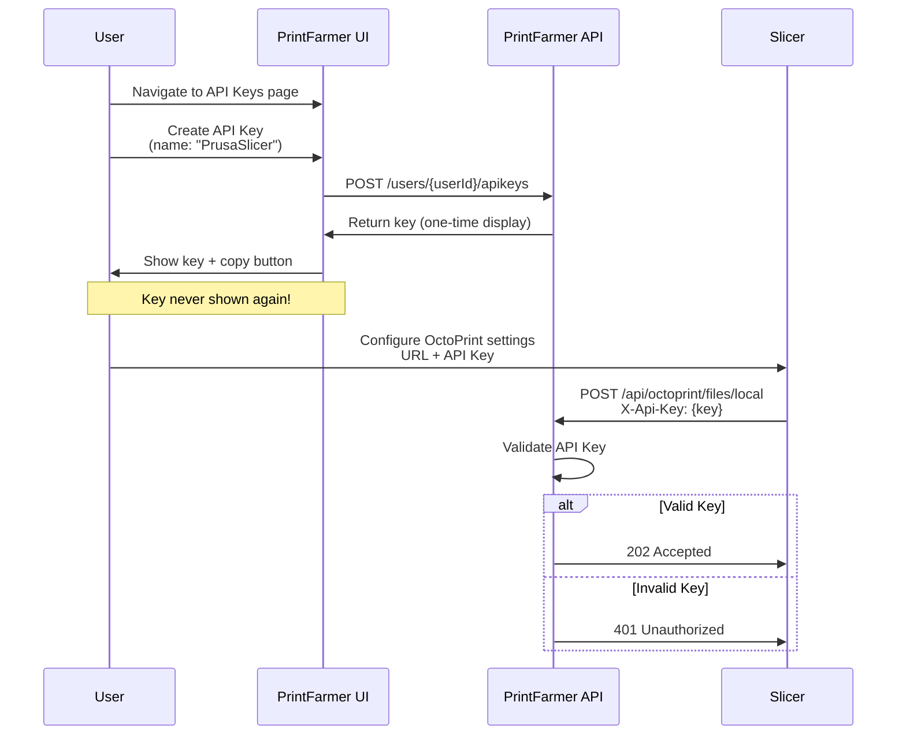

## Upload & Print Workflow

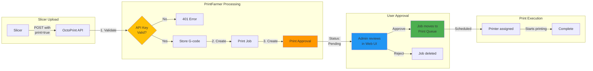

## API Key Management

### Key Features

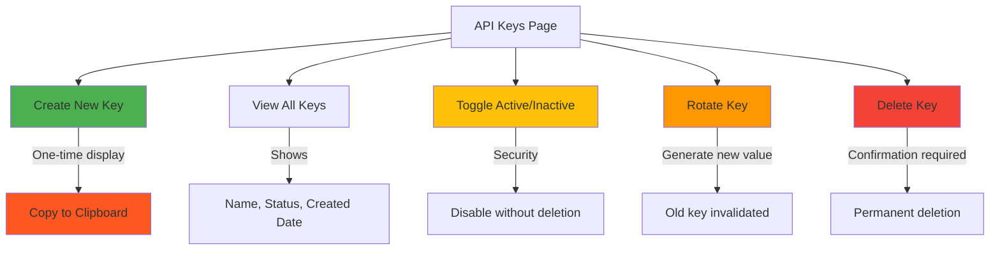

### Security Model

| Feature | Implementation |
|---------|---------------|
| **Storage** | SHA-256 hashed (never plaintext) |
| **Display** | Shown only once on creation |
| **Transmission** | HTTPS recommended (encrypt in transit) |
| **Scope** | Per-user (not global) |
| **Audit** | All uploads logged with API key ID |
| **Revocation** | Toggle inactive or delete |

## Rate Limiting

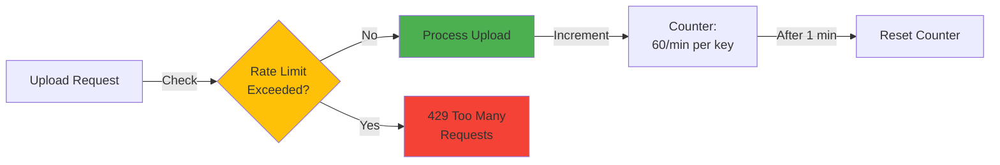

**Default Limits:**
- 60 uploads per minute per API key
- 50 MB max file size (configurable)

## Slicer Configuration

### Quick Setup Matrix

| Slicer | Version | Upload Support | Auto-Print | Notes |
|--------|---------|---------------|------------|-------|
| **PrusaSlicer** | 2.0+ | ✅ | ✅ | OctoPrint integration |
| **OrcaSlicer** | All | ✅ | ✅ | OctoPrint integration |
| **SuperSlicer** | All | ✅ | ✅ | Fork of PrusaSlicer |
| **Cura** | 4.0+ | ⚠️ | ⚠️ | Plugin required |

### Configuration Steps (Visual)

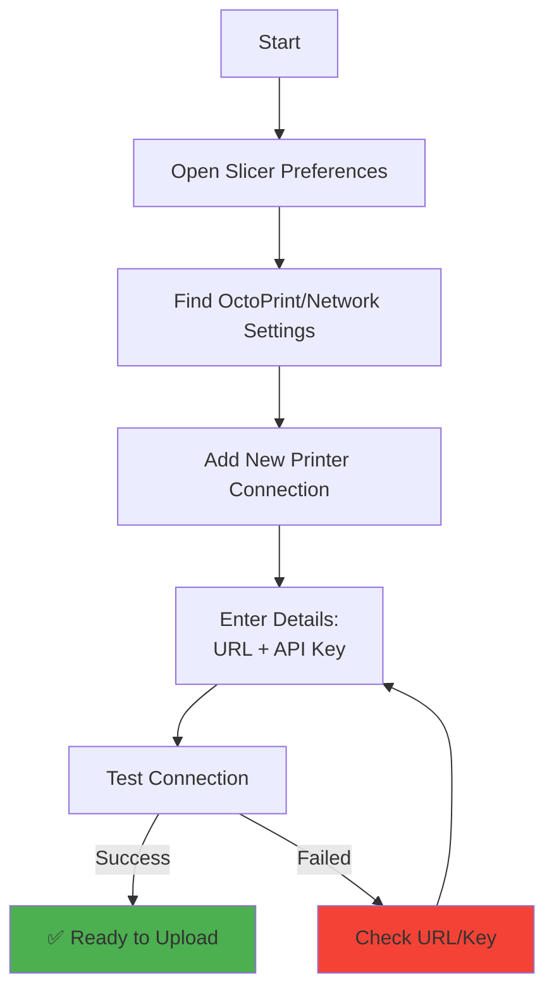

**Example Configuration:**
```
Name:     PrintFarmer
Host:     http://printfarmer.local:5245
Port:     (leave empty - included in host)
API Key:  <paste your key here>
HTTPS:    Unchecked (unless configured)
```

## Approval Workflow

### Why Approval Required?

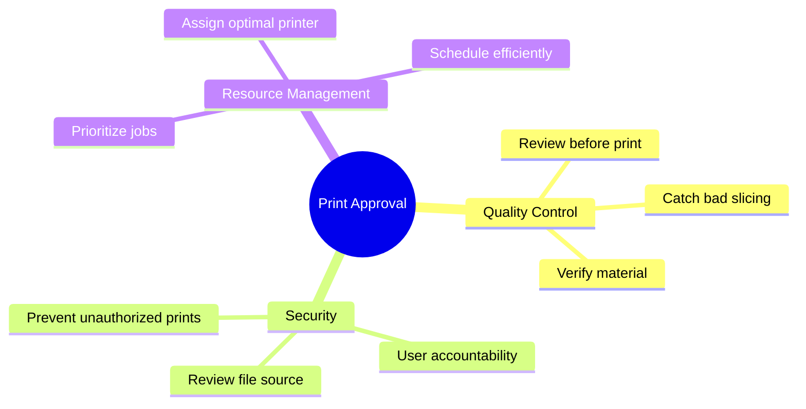

### Approval UI Flow

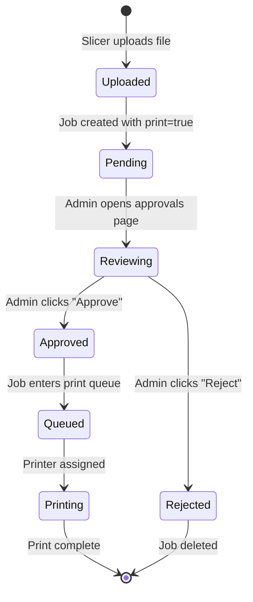

## Troubleshooting

### Common Issues & Solutions

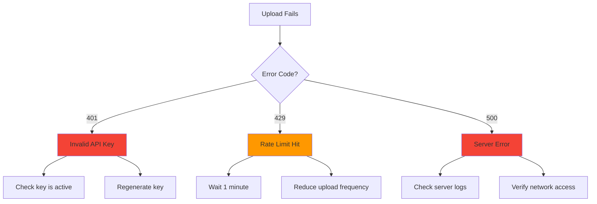

### Diagnostic Commands

```bash
# Test version endpoint (should return JSON)
curl http://printfarmer.local:5245/api/octoprint/version

# Test upload with API key
curl -X POST \
  -H "X-Api-Key: YOUR_KEY_HERE" \
  -F "file=@test.gcode" \
  http://printfarmer.local:5245/api/octoprint/files/local

# Check server logs
docker logs printfarmer-api | tail -50
```

## Comparison: OctoPrint API vs PrintFarmer Features

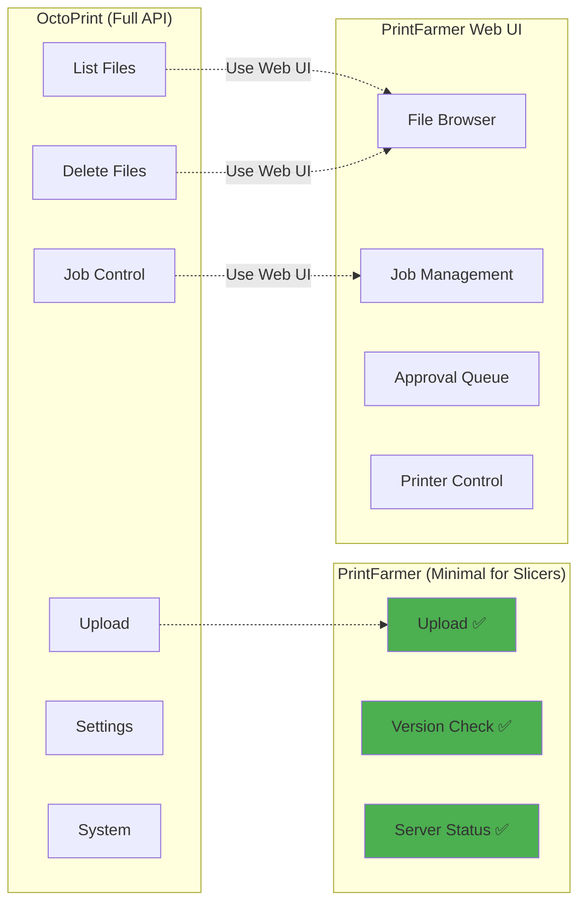

## Benefits

| Benefit | Description |
|---------|-------------|
| 🚀 **Faster Workflow** | Upload directly from slicer - no manual file transfer |
| 🔒 **Secure** | API keys with rate limiting and audit logging |
| ✅ **Quality Control** | Approval step prevents bad prints |
| 📊 **Centralized** | All files in one place with metadata |
| 🎯 **Multi-Printer** | Upload once, assign to any printer |
| 📱 **Mobile Friendly** | Approve prints from phone via web UI |

## Future Enhancements

Potential additions (not yet implemented):

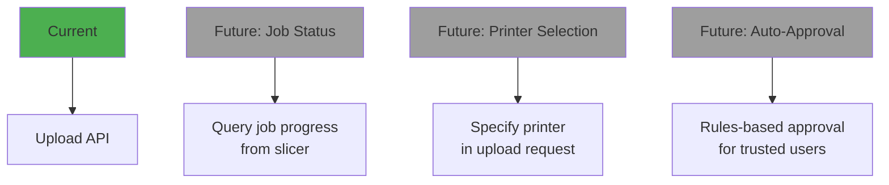

## Related Documentation

- 📖 **[Slicer Configuration Guide](SLICER_CONFIGURATION.md)** - Step-by-step setup for PrusaSlicer/OrcaSlicer
- 🔐 **[API Authentication](API.md#authentication)** - Complete API documentation
- 🏗️ **[Architecture Overview](ARCHITECTURE.md)** - PrintFarmer system architecture
- 🔧 **[OctoPrint Backend Integration](../dev/OctoPrint_Integration_Plan.md)** - Different feature (managing OctoPrint printers)

## Quick Reference Card

```
┌─────────────────────────────────────────────────────────┐
│          OCTOPRINT API SLICER INTEGRATION               │
├─────────────────────────────────────────────────────────┤
│ Purpose:  Enable slicers to upload G-code to PrintFarmer│
│ Auth:     API Keys (generate in Web UI)                 │
│ Rate:     60 uploads/min per key                        │
│ Size:     50 MB max file size                           │
├─────────────────────────────────────────────────────────┤
│ ENDPOINTS                                                │
│   GET  /api/octoprint/version       (no auth)          │
│   GET  /api/octoprint/server        (no auth)          │
│   POST /api/octoprint/files/local   (API key required)  │
├─────────────────────────────────────────────────────────┤
│ WORKFLOW                                                 │
│   1. Create API Key in PrintFarmer UI                  │
│   2. Configure slicer with URL + Key                   │
│   3. Slice model and "Send to OctoPrint"               │
│   4. File uploads → Pending Approval                   │
│   5. Approve in Web UI → Print Queue                   │
│   6. Printer starts printing                            │
├─────────────────────────────────────────────────────────┤
│ SLICER SETUP                                            │
│   Host:    http://printfarmer.local:5245                │
│   API Key: <from PrintFarmer → API Keys page>         │
│   HTTPS:   ❌ (unless you configured it)                │
└─────────────────────────────────────────────────────────┘
```

## Status

✅ **Feature Status**: Complete and production-ready

| Component | Status |
|-----------|--------|
| API Endpoints | ✅ Implemented |
| API Key Management | ✅ Implemented |
| Upload Workflow | ✅ Tested |
| Approval Integration | ✅ Working |
| Documentation | ✅ Complete |
| Slicer Compatibility | ✅ Verified (PrusaSlicer/OrcaSlicer) |

Last Updated: 2026-01-15
