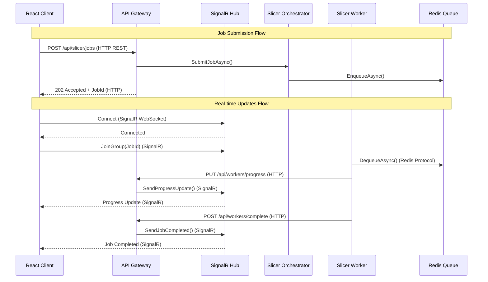

# ADR: Communication Protocol for Slicer Microservices

**Status**: Accepted  
**Date**: 2025-09-07  
**Decision Makers**: PrintFarmer Development Team  
**Technical Story**: [Epic #54 - Slicer Microservices Architecture](https://github.com/jpapiez/PrintFarmer/issues/54)

## Context

PrintFarmer's slicer microservices architecture requires multiple communication patterns: synchronous request/response for job management, asynchronous real-time updates for progress notifications, and worker-to-orchestrator communication for job processing. The communication protocols must support high throughput, low latency, and seamless integration with the existing React/ASP.NET Core architecture.

### Communication Patterns Required

1. **Client-to-API**: Job submission, status queries, file upload/download
2. **API-to-Client**: Real-time progress updates, job completion notifications  
3. **Worker-to-API**: Job status updates, heartbeat/health checks
4. **API-to-Queue**: Job enqueuing/dequeuing operations
5. **Worker-to-Storage**: File access for input models and output G-code

### Requirements

**Functional Requirements:**
- Synchronous request/response for CRUD operations
- Real-time bidirectional communication for progress updates
- Reliable message delivery for critical status changes
- Support for authentication and authorization
- File upload/download capabilities with large files (up to 1GB)

**Non-Functional Requirements:**
- Low latency: < 100ms for API calls, < 50ms for real-time updates
- High throughput: 1000+ requests/second sustained
- Browser compatibility: Support all modern browsers
- Platform compatibility: .NET, React TypeScript, Docker containers
- Operational simplicity: Leverage existing infrastructure

### Current Context
- PrintFarmer already uses ASP.NET Core Web API
- React TypeScript frontend with real-time requirements  
- SignalR backplane exists for real-time communication
- Standard HTTP infrastructure (load balancers, reverse proxies)
- No existing gRPC or message queue infrastructure

## Decision

**We will use a hybrid approach combining HTTP REST APIs with SignalR for real-time communication.**

### Primary Communication Stack

1. **HTTP REST API** for synchronous operations
   - Job submission and management
   - File upload/download operations  
   - Status queries and administrative tasks
   - Authentication and authorization

2. **SignalR** for real-time bidirectional communication
   - Live progress updates during slicing
   - Job completion notifications
   - Worker health status updates
   - Queue depth monitoring

3. **Direct HTTP** for worker-to-API communication
   - Worker registration and heartbeat
   - Job status updates from workers
   - Error reporting and logging

## Implementation Architecture



## Alternatives Considered

### 1. Pure gRPC Communication
**Pros:**
- High performance with Protocol Buffers serialization
- Built-in streaming support for real-time updates
- Strong typing with generated client/server stubs
- HTTP/2 multiplexing and server push

**Cons:**
- Limited browser support (requires gRPC-Web proxy)
- Learning curve for team unfamiliar with gRPC
- Additional infrastructure complexity (Envoy proxy)
- Less tooling support compared to REST
- Not compatible with existing HTTP infrastructure

**Decision**: Rejected due to browser compatibility and team familiarity concerns

### 2. Server-Sent Events (SSE) + REST
**Pros:**
- Simple browser support with EventSource API
- One-way real-time communication sufficient for many use cases
- Works through standard HTTP infrastructure
- No additional dependencies

**Cons:**
- One-way communication only (server to client)
- Limited connection management capabilities
- No built-in reconnection with state recovery
- Difficult to scale across multiple server instances
- No structured group/room management

**Decision**: Rejected due to lack of bidirectional communication

### 3. WebSockets + REST
**Pros:**
- Full bidirectional real-time communication
- Standard browser support
- Low-level control over message format
- Can optimize for specific use cases

**Cons:**
- Requires custom protocol design and implementation
- No built-in connection management or scaling
- Manual implementation of reconnection logic
- No authentication/authorization framework
- Complex operational setup for high availability

**Decision**: Rejected in favor of SignalR which provides WebSocket abstraction

### 4. Message Queue (RabbitMQ/Azure Service Bus) + REST  
**Pros:**
- Reliable message delivery with persistence
- Advanced routing and filtering capabilities
- Built-in retry and dead letter queue support
- Language-agnostic communication

**Cons:**
- Additional infrastructure complexity and cost
- Not suitable for direct browser communication
- Overkill for simple progress updates
- Learning curve for team unfamiliar with message queues
- Requires message queue to HTTP bridge for browsers

**Decision**: Rejected as over-engineered for real-time update requirements

### 5. Polling-Based REST Only
**Pros:**
- Simple implementation with familiar HTTP patterns
- Works with all existing infrastructure
- Easy debugging and monitoring
- No additional dependencies

**Cons:**
- High latency for real-time updates (polling interval)
- Inefficient resource usage (constant polling)
- Poor user experience with delayed updates
- Increased server load from frequent polling
- Difficult to coordinate updates across multiple clients

**Decision**: Rejected due to poor real-time performance characteristics

## Detailed Implementation

### HTTP REST API Design
```csharp
[Route("api/slicer")]
[ApiController]
public class SlicerController : ControllerBase
{
    [HttpPost("jobs")]
    public async Task<ActionResult<SlicingJobResponse>> SubmitJob([FromBody] SlicingJobRequest request)
    {
        var result = await _orchestrator.SubmitJobAsync(request);
        return Accepted(result); // 202 Accepted with job ID
    }

    [HttpGet("jobs/{jobId}")]
    public async Task<ActionResult<SlicingJobStatusResponse>> GetJobStatus(Guid jobId)
    {
        var status = await _orchestrator.GetJobStatusAsync(jobId);
        return status != null ? Ok(status) : NotFound();
    }

    [HttpPost("jobs/{jobId}/cancel")]
    public async Task<IActionResult> CancelJob(Guid jobId)
    {
        await _orchestrator.CancelJobAsync(jobId);
        return NoContent(); // 204 No Content
    }
}
```

### SignalR Hub Implementation
```csharp
[Authorize]
public class SlicerHub : Hub
{
    public async Task JoinJobGroup(Guid jobId)
    {
        // Verify user has access to this job
        if (await _authService.UserCanAccessJobAsync(Context.UserIdentifier, jobId))
        {
            await Groups.AddToGroupAsync(Context.ConnectionId, $"job-{jobId}");
        }
    }

    public async Task LeaveJobGroup(Guid jobId)
    {
        await Groups.RemoveFromGroupAsync(Context.ConnectionId, $"job-{jobId}");
    }
}

// Progress notification service
public class SignalRSlicerProgressNotifier : ISlicerProgressNotifier
{
    public async Task NotifyProgressAsync(Guid jobId, SlicingProgressUpdate update)
    {
        await _hubContext.Clients.Group($"job-{jobId}")
            .SendAsync("ProgressUpdate", new { JobId = jobId, Progress = update });
    }

    public async Task NotifyJobCompleted(Guid jobId, SlicingResult result)
    {
        await _hubContext.Clients.Group($"job-{jobId}")
            .SendAsync("JobCompleted", new { JobId = jobId, Result = result });
    }
}
```

### React TypeScript Client Implementation
```typescript
// REST API client
export class SlicerApiClient {
    async submitJob(request: SlicingJobRequest): Promise<SlicingJobResponse> {
        const response = await fetch('/api/slicer/jobs', {
            method: 'POST',
            headers: { 'Content-Type': 'application/json' },
            body: JSON.stringify(request)
        });
        return await response.json();
    }

    async getJobStatus(jobId: string): Promise<SlicingJobStatusResponse> {
        const response = await fetch(`/api/slicer/jobs/${jobId}`);
        return await response.json();
    }
}

// SignalR client  
export class SlicerRealTimeClient {
    private connection: HubConnection;

    constructor() {
        this.connection = new HubConnectionBuilder()
            .withUrl('/hubs/slicer', { accessTokenFactory: () => this.getAuthToken() })
            .withAutomaticReconnect()
            .build();
    }

    async start(): Promise<void> {
        await this.connection.start();
    }

    async joinJobGroup(jobId: string): Promise<void> {
        await this.connection.invoke('JoinJobGroup', jobId);
    }

    onProgressUpdate(callback: (update: ProgressUpdate) => void): void {
        this.connection.on('ProgressUpdate', callback);
    }

    onJobCompleted(callback: (result: JobResult) => void): void {
        this.connection.on('JobCompleted', callback);
    }
}
```

### Worker Communication Pattern
```csharp
public class SlicerWorker
{
    private readonly HttpClient _httpClient;
    private readonly string _workerId;

    public async Task ReportProgressAsync(Guid jobId, int progress, string currentStep)
    {
        var update = new WorkerProgressUpdate
        {
            WorkerId = _workerId,
            JobId = jobId,
            Progress = progress,
            CurrentStep = currentStep,
            Timestamp = DateTime.UtcNow
        };

        await _httpClient.PutAsync($"/api/workers/progress", JsonContent.Create(update));
    }

    public async Task ReportJobCompleted(Guid jobId, SlicingResult result)
    {
        var completion = new WorkerJobCompletion
        {
            WorkerId = _workerId,
            JobId = jobId,
            Result = result,
            CompletedAt = DateTime.UtcNow
        };

        await _httpClient.PostAsync($"/api/workers/complete", JsonContent.Create(completion));
    }
}
```

## Trade-offs

### Advantages of HTTP REST + SignalR
✅ **Browser Native**: Excellent browser support without additional setup  
✅ **Team Familiarity**: Leverages existing ASP.NET Core and React expertise  
✅ **Infrastructure Compatibility**: Works with existing HTTP load balancers and proxies  
✅ **Development Tooling**: Rich debugging and monitoring tools available  
✅ **Incremental Adoption**: Can implement real-time features progressively  
✅ **Authentication Integration**: Built-in support for JWT and cookie authentication  
✅ **Operational Simplicity**: No additional message brokers or protocols to manage  

### Disadvantages of HTTP REST + SignalR
❌ **Connection Management**: SignalR connections consume server resources  
❌ **Scaling Complexity**: Requires Redis backplane for multi-instance scaling  
❌ **Protocol Overhead**: HTTP headers and JSON serialization add bandwidth usage  
❌ **Websocket Limitations**: Corporate firewalls may block WebSocket connections  
❌ **State Management**: SignalR connection state needs careful management  
❌ **Debugging Complexity**: Real-time communication harder to debug than simple HTTP  

### Risk Mitigation Strategies

1. **Connection Scaling**
   ```csharp
   services.AddSignalR()
       .AddStackExchangeRedis(connectionString) // Redis backplane for scaling
       .AddJsonProtocol(options => 
       {
           options.PayloadSerializerOptions.PropertyNamingPolicy = JsonNamingPolicy.CamelCase;
       });
   ```

2. **Fallback Strategy**
   ```typescript
   export class SlicerClient {
       private useRealTime = true;
       
       async initialize(): Promise<void> {
           try {
               await this.realTimeClient.start();
           } catch (error) {
               console.warn('Real-time connection failed, falling back to polling');
               this.useRealTime = false;
               this.startPolling();
           }
       }
       
       private startPolling(): void {
           setInterval(async () => {
               const status = await this.apiClient.getJobStatus(this.jobId);
               this.onStatusUpdate(status);
           }, 5000); // Poll every 5 seconds
       }
   }
   ```

3. **Connection Health Monitoring**
   ```csharp
   public class SignalRHealthCheck : IHealthCheck
   {
       public Task<HealthCheckResult> CheckHealthAsync(HealthCheckContext context, CancellationToken cancellationToken = default)
       {
           var connectionCount = _connectionManager.GetConnectionCount();
           var isHealthy = connectionCount < _maxConnections * 0.9; // 90% capacity threshold
           
           return Task.FromResult(isHealthy 
               ? HealthCheckResult.Healthy($"Active connections: {connectionCount}")
               : HealthCheckResult.Degraded($"High connection count: {connectionCount}"));
       }
   }
   ```

## Performance Characteristics

### HTTP REST API Performance
| Operation | Expected Latency | Throughput | Notes |
|-----------|------------------|------------|-------|
| Submit Job | < 100ms P99 | 500 req/sec | Includes validation and queuing |
| Status Query | < 50ms P99 | 2000 req/sec | Read-only database query |
| File Upload | 1-10s | 50 MB/s | Depends on file size and network |
| Cancel Job | < 100ms P99 | 1000 req/sec | Queue update operation |

### SignalR Real-time Performance  
| Metric | Target | Capacity | Notes |
|--------|--------|----------|-------|
| Connection Latency | < 50ms | 10,000+ connections | With Redis backplane |
| Message Throughput | < 10ms | 50,000 msg/sec | Broadcast to groups |
| Reconnection Time | < 5s | N/A | Automatic reconnect |
| Memory Usage | 1KB per connection | 10GB for 10M connections | Connection state overhead |

### Bandwidth Usage
```csharp
// Typical message sizes
public class MessageSizes
{
    public const int ProgressUpdate = 150;      // bytes
    public const int JobCompleted = 500;       // bytes  
    public const int WorkerHeartbeat = 100;    // bytes
    public const int JsonOverhead = 50;        // bytes per message
    public const int HttpOverhead = 400;       // bytes per HTTP request
}

// Bandwidth calculation for 100 concurrent jobs with 1-second progress updates
// 100 jobs * 150 bytes * 60 updates/min = 900KB/min = 15KB/sec
```

## Security Implementation

### Authentication & Authorization
```csharp
// JWT-based API authentication
[Authorize(Policy = "SlicerUser")]
[HttpPost("jobs")]
public async Task<IActionResult> SubmitJob([FromBody] SlicingJobRequest request)
{
    // User context available through HttpContext.User
    var userId = HttpContext.User.FindFirst(ClaimTypes.NameIdentifier)?.Value;
    request.UserId = Guid.Parse(userId);
    return await ProcessJobSubmission(request);
}

// SignalR hub authorization
[Authorize]
public class SlicerHub : Hub
{
    public override async Task OnConnectedAsync()
    {
        var userId = Context.UserIdentifier;
        await Groups.AddToGroupAsync(Context.ConnectionId, $"user-{userId}");
        await base.OnConnectedAsync();
    }
}
```

### HTTPS/WSS Enforcement
```csharp
services.Configure<HstsOptions>(options =>
{
    options.Preload = true;
    options.IncludeSubDomains = true;
    options.MaxAge = TimeSpan.FromDays(365);
});

app.UseHttpsRedirection();
app.UseHsts();

// SignalR automatically uses WSS (WebSocket Secure) when served over HTTPS
```

### Rate Limiting
```csharp
services.AddRateLimiter(options =>
{
    options.AddFixedWindowLimiter("SlicerApi", rateLimiterOptions =>
    {
        rateLimiterOptions.PermitLimit = 100;           // 100 requests
        rateLimiterOptions.Window = TimeSpan.FromMinutes(1);  // per minute
    });
});

[EnableRateLimiting("SlicerApi")]
[HttpPost("jobs")]
public async Task<IActionResult> SubmitJob([FromBody] SlicingJobRequest request)
```

## Monitoring and Observability

### HTTP API Metrics
```csharp
// Custom metrics for slicer operations
private static readonly Counter _jobsSubmitted = Metrics.CreateCounter("printfarmer_slicer_jobs_submitted_total");
private static readonly Histogram _requestDuration = Metrics.CreateHistogram("printfarmer_slicer_request_duration_seconds");
private static readonly Gauge _activeJobs = Metrics.CreateGauge("printfarmer_slicer_active_jobs");

[HttpPost("jobs")]
public async Task<IActionResult> SubmitJob([FromBody] SlicingJobRequest request)
{
    _jobsSubmitted.Inc();
    using var timer = _requestDuration.NewTimer();
    
    var result = await _orchestrator.SubmitJobAsync(request);
    _activeJobs.Set(await GetActiveJobCount());
    
    return Accepted(result);
}
```

### SignalR Connection Metrics
```csharp
public class SignalRMetrics : Hub
{
    private static readonly Gauge _activeConnections = Metrics.CreateGauge("printfarmer_signalr_connections_active");
    
    public override async Task OnConnectedAsync()
    {
        _activeConnections.Inc();
        await base.OnConnectedAsync();
    }
    
    public override async Task OnDisconnectedAsync(Exception exception)
    {
        _activeConnections.Dec();
        await base.OnDisconnectedAsync(exception);
    }
}
```

### Distributed Tracing
```csharp
services.AddOpenTelemetry()
    .WithTracing(builder =>
    {
        builder
            .AddAspNetCoreInstrumentation()
            .AddHttpClientInstrumentation()
            .AddRedisInstrumentation()
            .SetSampler(new AlwaysOnSampler())
            .AddJaegerExporter();
    });
```

## Success Criteria

### Performance Targets
- **API Response Time**: < 100ms P95 for job operations
- **Real-time Latency**: < 50ms for progress updates  
- **Throughput**: 1000+ API requests/second sustained
- **Connection Capacity**: 10,000+ concurrent SignalR connections
- **Availability**: 99.9% uptime for both HTTP and SignalR

### Developer Experience
- **API Documentation**: Complete OpenAPI/Swagger documentation
- **Client Libraries**: Type-safe TypeScript clients for all operations  
- **Testing**: Unit and integration tests for all communication patterns
- **Debugging**: Clear error messages and comprehensive logging

### Operational Targets
- **Monitoring**: Real-time visibility into communication patterns
- **Scaling**: Horizontal scaling without communication disruption
- **Maintenance**: Zero-downtime deployments for communication updates

## Rollback Plan

If the HTTP REST + SignalR approach proves inadequate:

### Phase 1: Immediate Fallback
```typescript
// Graceful degradation to polling
export class CommunicationManager {
    async initialize(): Promise<void> {
        try {
            await this.initializeSignalR();
        } catch (error) {
            console.warn('SignalR failed, using polling fallback');
            this.initializePolling();
        }
    }
}
```

### Phase 2: Alternative Protocol Implementation
1. **Short-term**: Server-Sent Events for one-way real-time updates
2. **Medium-term**: gRPC-Web for high-performance communication
3. **Long-term**: Native WebSocket implementation with custom protocol

### Migration Strategy
```csharp
// Protocol abstraction enables switching
public interface ICommunicationProvider
{
    Task SendToUserAsync(string userId, string message);
    Task SendToGroupAsync(string groupId, string message);
    Task<bool> IsConnectedAsync(string connectionId);
}

// Factory pattern for protocol selection
services.AddSingleton<ICommunicationProvider>(provider =>
{
    var config = provider.GetRequiredService<IConfiguration>();
    return config.GetValue<string>("Communication:Protocol") switch
    {
        "SignalR" => provider.GetRequiredService<SignalRCommunicationProvider>(),
        "SSE" => provider.GetRequiredService<ServerSentEventsCommunicationProvider>(),
        "gRPC" => provider.GetRequiredService<GrpcCommunicationProvider>(),
        _ => throw new InvalidOperationException("Unknown communication protocol")
    };
});
```

### Rollback Triggers
- SignalR connection scaling issues beyond 5,000 concurrent users
- Real-time latency consistently > 500ms
- HTTP API throughput < 500 requests/second under load
- Operational complexity becomes unmanageable for team
- Browser compatibility issues affect > 5% of users

## Timeline

### Implementation (Completed)
- **Week 1**: Core HTTP REST API endpoints ✅
- **Week 2**: SignalR hub and real-time progress updates ✅  
- **Week 3**: React TypeScript client integration ✅
- **Week 4**: Authentication, rate limiting, and monitoring ✅

### Validation (Next 3 months)
- **Month 1**: Load testing and performance validation
- **Month 2**: Real-time communication scaling tests
- **Month 3**: Browser compatibility and fallback testing

### Enhancement (6-12 months)
- **Advanced Features**: Message queuing for reliable delivery
- **Performance Optimization**: Custom serialization and compression
- **Protocol Evolution**: Evaluate HTTP/3 and WebTransport adoption

## References

- [ASP.NET Core SignalR](https://docs.microsoft.com/en-us/aspnet/core/signalr/)
- [SignalR Performance and Scaling](https://docs.microsoft.com/en-us/aspnet/core/signalr/scale)
- [ASP.NET Core Web APIs](https://docs.microsoft.com/en-us/aspnet/core/web-api/)
- [React SignalR Integration](https://docs.microsoft.com/en-us/aspnet/core/signalr/javascript-client)
- [PrintFarmer Slicer Architecture](slicer-microservices.md)
- [SignalRSlicerProgressNotifier Implementation](../../src/api/Services/SlicerServices/SignalRSlicerProgressNotifier.cs)