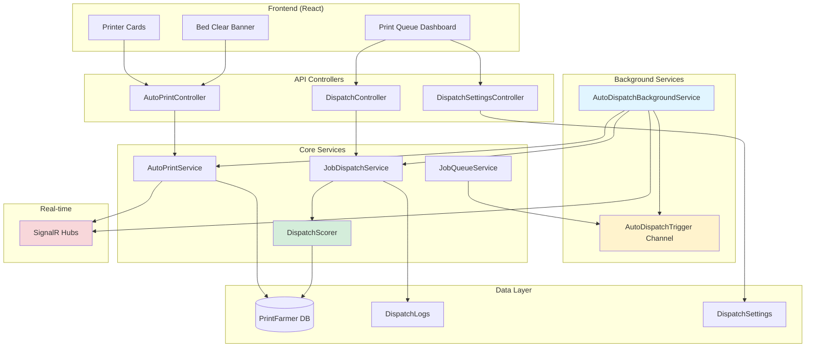
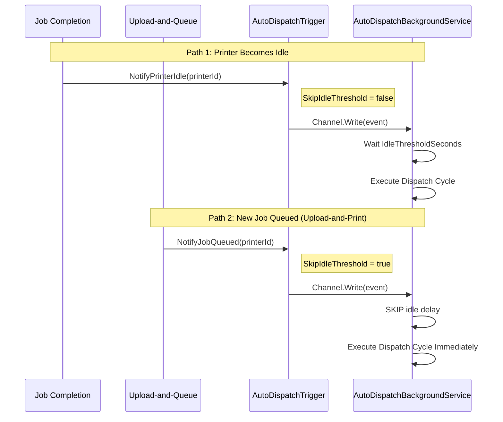
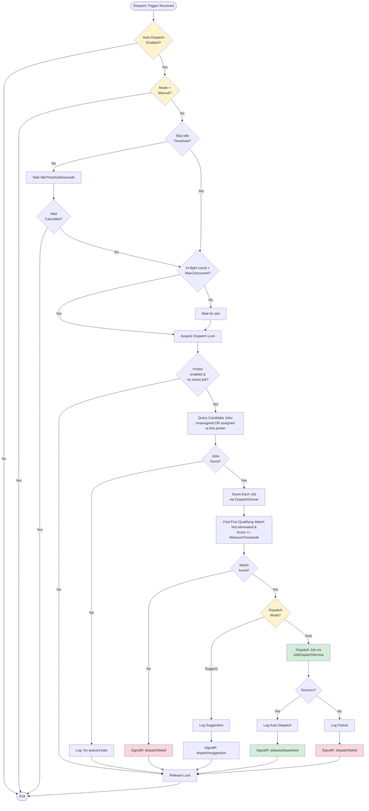
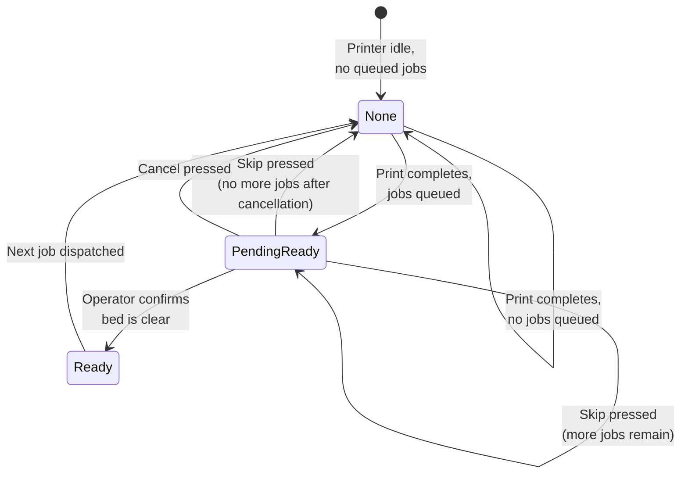

# Auto-Dispatch System Documentation

## Table of Contents

- [Overview](#overview)
- [Architecture](#architecture)
- [Concepts](#concepts)
- [System Components](#system-components)
- [Trigger Flow](#trigger-flow)
- [Dispatch Cycle](#dispatch-cycle)
- [Ready Gate Flow](#ready-gate-flow)
- [Scoring System](#scoring-system)
- [Dispatch Modes](#dispatch-modes)
- [Configuration](#configuration)
- [API Endpoints](#api-endpoints)
- [SignalR Events](#signalr-events)
- [Frontend UI](#frontend-ui)
- [Design Decisions](#design-decisions)

---

## Overview

The Auto-Dispatch system automatically assigns print jobs to available printers based on multi-factor compatibility scoring. It enables lights-out printing by continuously distributing work across your printer farm while ensuring the right job reaches the right printer.

**Key Benefits:**
- Maximizes printer utilization by eliminating idle time
- Ensures material and hardware compatibility through weighted scoring
- Provides audit trails for all dispatch decisions
- Supports both fully automatic and suggestion-based workflows
- Implements safety gates for bed clearing between consecutive prints

---

## Architecture

### Component Diagram



---

## Concepts

The Auto-Dispatch system comprises three distinct but related concepts:

### 1. Auto-Dispatch (Core System)
The system that automatically assigns queued print jobs to available printers based on compatibility scoring. This is the primary focus of this document.

**How it works:**
- Background service monitors printer idle events via a channel-based trigger
- When a printer becomes idle, the system scores all queued jobs against that printer
- Best match is either suggested (Suggest mode) or automatically dispatched (Auto mode)

### 2. Ready Gate (Between-Print Safety)
A confirmation workflow that ensures operators clear the print bed before the next job starts. This prevents print-on-print collisions and ensures quality.

**Workflow:**
1. Print completes on auto-dispatch-enabled printer
2. Printer transitions to `PendingReady` state
3. UI displays "Bed Clear Banner" with Confirm/Skip/Cancel buttons
4. Operator confirms bed is clear
5. Next queued job is dispatched

### 3. Auto-Print (Future Hardware Feature)
**Status:** Not yet implemented. Planned for future releases.

A hardware-level feature where printers with automated bed-clearing mechanisms (e.g., self-ejecting beds, conveyor belts) can accept consecutive jobs without human intervention. Ready Gate would be bypassed for these printers.

---

## System Components

### AutoDispatchTrigger.cs
**Purpose:** Channel-based event queue for notifying the background service when dispatch should occur.

**Key Features:**
- Uses bounded channel with capacity of 64 events (drops oldest on overflow)
- Two trigger types:
  - `NotifyPrinterIdle(printerId)` — Printer finished a job (applies idle threshold delay)
  - `NotifyJobQueued(printerId)` — New job uploaded-and-assigned (skips idle delay for immediate dispatch)
- Per-printer cancellation tokens for aborting pending idle waits

**Event Payload:**
```csharp
public readonly record struct DispatchTriggerEvent(
    Guid PrinterId, 
    bool SkipIdleThreshold
);
```

### AutoDispatchBackgroundService.cs
**Purpose:** Event-driven background service that orchestrates the dispatch cycle.

**Key Features:**
- Consumes trigger events from the channel (non-blocking, event-driven — no polling)
- Runs each printer's dispatch cycle on its own `Task` for concurrent processing
- Uses `SemaphoreSlim` to serialize job-to-printer assignment (prevents two printers from grabbing the same job)
- Respects `MaxConcurrentDispatches` limit to prevent thundering herd
- Tracks in-flight dispatch count with `Interlocked` operations

**Thread Safety:**
```csharp
private readonly SemaphoreSlim _dispatchLock = new(1, 1); // Serializes assignment
private int _inFlightCount; // Concurrent dispatch limiter
```

### DispatchScorer.cs
**Purpose:** Multi-factor weighted scoring engine for printer-job compatibility.

**Scoring Algorithm:**
1. Pre-filter printers (enabled, not in maintenance, available)
2. Evaluate 10 scoring factors (see [Scoring System](#scoring-system))
3. Calculate weighted average: `Σ(score × weight) / Σ(weights)`
4. Hard requirements eliminate printers when violated
5. Sort by score descending, eliminated printers at end

**Batch Optimization:**
- Loads queue depths for all printers in one query
- Resolves filament types for enclosure/abrasive checks
- Uses split queries and `AsNoTracking()` for performance

### AutoPrintService.cs
**Purpose:** Manages the Ready Gate workflow for bed-clear confirmation.

**State Machine:**
```
None → PendingReady → Ready → (dispatch) → None
         ↓                ↓
      (Cancel)         (Skip)
         ↓                ↓
       None          PendingReady (if more jobs) or None
```

**Responsibilities:**
- Transitions printer to `PendingReady` after job completion (called by `PrintJobCompletionService`)
- Marks printer as `Ready` when operator confirms bed is clear
- Performs filament pre-flight checks (material match, sufficient weight)
- Skips next queued job (cancels it) if operator requests
- Cancels auto-print workflow (returns to `None` state)

### JobQueueService.cs
**Purpose:** Manages print job queue operations and triggers auto-dispatch.

**Auto-Dispatch Integration:**
- After queuing a job assigned to a specific printer: calls `NotifyJobQueued(printerId)` (skips idle threshold)
- This enables upload-and-print workflows to dispatch immediately

### JobDispatchService.cs
**Purpose:** Orchestrates dispatch operations — scoring candidates and assigning jobs to printers.

**Key Methods:**
- `FindCandidatesAsync(jobId)` — Scores all printers for a job, returns ranked list
- `DispatchJobAsync(jobId, printerId, userId)` — Assigns job to printer, logs dispatch, triggers print start

**Audit Trail:**
- Logs all dispatch decisions to `DispatchLogs` table
- Stores score breakdown as JSON for post-mortem analysis
- Records dispatch mode (Manual, Suggested, Auto)

---

## Trigger Flow

Two distinct trigger paths feed the dispatch cycle:



**Path 1: Printer Becomes Idle**
1. Print job completes
2. `PrintJobCompletionService` calls `AutoDispatchTrigger.NotifyPrinterIdle(printerId)`
3. Trigger writes event to channel with `SkipIdleThreshold = false`
4. Background service waits `IdleThresholdSeconds` (configurable delay, default 10s)
5. After delay, executes dispatch cycle

**Why the delay?** Allows time for:
- Printer status to stabilize
- Operator to inspect the finished print
- Cooling/post-processing before next job

**Path 2: New Job Queued (Upload-and-Print)**
1. User uploads G-code file with printer pre-assigned
2. `JobQueueService.QueueJob()` calls `AutoDispatchTrigger.NotifyJobQueued(printerId)`
3. Trigger writes event with `SkipIdleThreshold = true`
4. Background service SKIPS idle threshold delay
5. Executes dispatch cycle immediately

**Why skip the delay?** User explicitly chose a printer and expects immediate dispatch. No need to wait — job should start ASAP.

**Cancellation Support:**
If a printer goes offline before the idle threshold elapses, the pending wait is cancelled via `CancelPendingDispatch(printerId)`.

---

## Dispatch Cycle

Step-by-step process when a printer triggers a dispatch cycle:



**Step Details:**

1. **Check Settings** — Read `DispatchSettings` singleton. Exit if disabled or mode is Manual.

2. **Idle Threshold** — If trigger is from job completion (not upload-and-queue), wait the configured delay. Cancellable if printer goes offline.

3. **Concurrency Limit** — Check `MaxConcurrentDispatches` limit. If reached, log warning and exit (prevents thundering herd).

4. **Acquire Lock** — Enter `SemaphoreSlim` critical section. This serializes the query-score-assign window so two printers can't grab the same job.

5. **Verify Printer** — Re-check printer is still enabled, online, and has no active job. Status may have changed during the idle wait.

6. **Query Candidates** — Find jobs with `Status = Queued` and `(AssignedPrinterId = null OR AssignedPrinterId = thisId)`. Ordered by `Priority → QueuePosition → QueuedAt`. Limit to 20 jobs to keep scoring fast.

7. **Score Jobs** — For each candidate, call `DispatchScorer.ScorePrintersForJobAsync()` and find this printer's score.

8. **Find Best Match** — Select the first job where:
   - This printer is not eliminated (hard requirements pass)
   - Score >= `MinimumScoreThreshold` (configurable, default 50)

9. **Mode: Suggest** — Log the suggestion to `DispatchLogs`. Send `dispatchsuggestion` SignalR event. Operator must manually dispatch via UI.

10. **Mode: Auto** — Call `JobDispatchService.DispatchJobAsync()` to assign and start the job. Log success/failure. Send `jobautodispatched` or `dispatchfailed` SignalR event.

11. **Release Lock** — Exit the critical section. Another printer's dispatch cycle can now proceed.

---

## Ready Gate Flow

State machine for the bed-clear confirmation workflow:



**State Descriptions:**

- **None** — Default state. Printer is idle and not awaiting bed confirmation.
- **PendingReady** — Print completed on auto-dispatch-enabled printer with queued jobs. Awaiting operator confirmation that bed is clear.
- **Ready** — Operator confirmed bed is clear. Next queued job is eligible for dispatch.

**Actions:**

- **Confirm** — Operator presses Confirm button on Bed Clear Banner:
  1. Transitions to `Ready` state
  2. Performs filament pre-flight check (material match, sufficient weight)
  3. If check passes, dispatches next queued job via API
  4. Transitions back to `None`
  5. If check fails, shows warning and stays in `Ready` (operator must manually fix and dispatch)

- **Skip** — Operator presses Skip button:
  1. Cancels next queued job (`Status = Cancelled`)
  2. If more jobs remain, stays in `PendingReady`
  3. If no jobs remain, transitions to `None`

- **Cancel** — Operator presses Cancel button:
  1. Transitions to `None` immediately
  2. Queued jobs remain queued but auto-dispatch is paused for this printer

**UI Integration:**
The `BedClearBanner` component appears on printer cards when `AutoPrintState = PendingReady`. It displays three action buttons with loading states and disabled states when another action is in progress.

---

## Scoring System

The `DispatchScorer` evaluates printer-job compatibility using 10 weighted factors:

### Scoring Factors

| Factor | Weight | Type | Description |
|--------|--------|------|-------------|
| **Material Match** | 100 | Hard | Printer must support the required material type. Exact loaded match = 100, supported but not loaded = 50, model-level support = 40, no data = 30, unsupported = eliminated |
| **Nozzle Diameter** | 100 | Hard | Nozzle diameter must match required diameter (±0.01mm tolerance). Exact match = 100, no nozzle data = 50, mismatch = eliminated |
| **Nozzle Hardness** | 80 | Hard* | If material is abrasive, printer must have hardened nozzle. Has hardened = 100, no nozzle data = 30, lacks hardened = eliminated |
| **Enclosure** | 80 | Hard* | If material requires enclosure (e.g., ABS, ASA), printer must have one. Has enclosure = 100, lacks = eliminated |
| **Printer Model Match** | 60 | Soft | Exact model match = 100, same manufacturer = 50, different manufacturer = 30 |
| **Build Volume** | 50 | Soft | Printer's build volume must fit the job. Fits comfortably = 100, tight fit = 20, no gcode size data = 70 |
| **Preferred Printer** | 40 | Hard* | If job has preferred printer list, printer must be in it. In list = 100, not in list = 30, explicitly excluded = eliminated |
| **Queue Depth** | 30 | Soft | Favor printers with shorter queues. Depth 0 = 100, 1-2 = 70, 3-5 = 40, 6+ = 10 |
| **Printer Group** | 0 | Hard* | If gcode has `PrinterGroupId`, printer must be in that group. Eliminates if mismatch. Zero weight (gate, not scoring factor) |
| **Availability** | 0 | Hard | Printer must be available, not in maintenance, enabled, and not in `PendingReady`. Zero weight (pre-filter) |

**Hard vs Soft Requirements:**
- **Hard Requirements** (marked with `IsHardRequirement: true`) — A score of 0 eliminates the printer. It cannot be assigned this job.
- **Soft Requirements** — Low scores reduce the weighted average but don't eliminate. Printer remains eligible.

(*) Some factors are conditionally hard. For example, Enclosure is only a hard requirement if the material needs an enclosure.

### Scoring Algorithm

```
1. For each printer:
   a. Evaluate all 10 factors → FactorScore{Score, Weight, IsHardRequirement}
   b. If any hard requirement = 0, eliminate printer
   c. Calculate weighted average: Σ(score × weight) / Σ(weights)

2. Sort results:
   a. Non-eliminated printers sorted by score descending
   b. Eliminated printers at the end
```

### Example Score Breakdown

**Job Requirements:**
- Material: PLA
- Nozzle: 0.4mm
- Printer Model: Prusa MK4
- Preferred: None

**Candidate Printer (Prusa MK4S):**
```json
{
  "printerId": "abc-123",
  "printerName": "MK4S-01",
  "totalScore": 87.25,
  "eliminated": false,
  "scoreBreakdown": {
    "Availability": { "score": 100, "weight": 0 },
    "MaterialMatch": { "score": 100, "weight": 100 },  // PLA loaded
    "NozzleDiameter": { "score": 100, "weight": 100 }, // 0.4mm exact match
    "BuildVolume": { "score": 100, "weight": 50 },     // Fits comfortably
    "Enclosure": { "score": 100, "weight": 80 },       // PLA doesn't need one
    "NozzleHardness": { "score": 100, "weight": 80 },  // PLA isn't abrasive
    "ModelMatch": { "score": 50, "weight": 60 },       // Same manufacturer (Prusa)
    "QueueDepth": { "score": 70, "weight": 30 },       // 1 job queued
    "Preferred": { "score": 70, "weight": 40 },        // No preference set
    "PrinterGroup": { "score": 100, "weight": 0 }      // No group restriction
  }
}
```

**Weighted Average Calculation:**
```
Score = (100×100 + 100×100 + 100×50 + 100×80 + 100×80 + 50×60 + 70×30 + 70×40) / (100+100+50+80+80+60+30+40)
      = 46,900 / 540
      = 86.85 (rounded to 87.25 in actual implementation)
```

---

## Dispatch Modes

The system supports three operational modes:

### Manual
**Behavior:** Auto-dispatch is disabled. All job assignments must be done manually by operators.

**Use Case:** Full operator control. Useful during testing, commissioning new printers, or when manual job routing is preferred.

**Trigger Response:** Background service exits immediately when it reads the trigger event.

### Suggest
**Behavior:** System scores jobs and sends suggestions via SignalR, but does NOT automatically dispatch.

**Use Case:** Operator approval workflow. Farm manager reviews scored candidates and decides which assignments to accept.

**Trigger Response:**
1. Score candidate jobs for the idle printer
2. Find best match above minimum threshold
3. Log suggestion to `DispatchLogs`
4. Send `dispatchsuggestion` SignalR event to UI
5. Operator manually dispatches via "Dispatch" button in UI

**UI Notification Example:**
```
Job "Benchy-v2.gcode" suggested for Printer MK4-02 (Score: 92.4)
[View] [Dispatch] [Dismiss]
```

### Auto
**Behavior:** System scores jobs and automatically dispatches the best match without operator intervention.

**Use Case:** Lights-out printing. Maximizes throughput by eliminating human delay in job assignment.

**Trigger Response:**
1. Score candidate jobs for the idle printer
2. Find best match above minimum threshold
3. Call `JobDispatchService.DispatchJobAsync()` to assign and start the job
4. Log dispatch to `DispatchLogs`
5. Send `jobautodispatched` SignalR event to UI
6. Job begins printing immediately (subject to Ready Gate confirmation if enabled)

**Safety Net:** Even in Auto mode, the Ready Gate (if enabled on printer) requires operator confirmation between consecutive prints.

---

## Configuration

Auto-dispatch behavior is controlled by:
1. **System-level settings** — Global configuration affecting all printers
2. **Per-printer opt-in** — Each printer can enable/disable auto-dispatch

### System-Level Settings (Singleton Entity)

Stored in `DispatchSettings` table (single row):

| Setting | Type | Default | Description |
|---------|------|---------|-------------|
| `AutoDispatchEnabled` | `bool` | `false` | Master on/off switch for the entire system |
| `AutoDispatchMode` | `enum` | `Manual` | Dispatch mode: `Manual`, `Suggest`, or `Auto` |
| `IdleThresholdSeconds` | `int` | `10` | Delay after print completion before dispatch cycle runs (seconds). Skipped for upload-and-print triggers |
| `MinimumScoreThreshold` | `double` | `50.0` | Minimum compatibility score required (0–100). Jobs below this are not dispatched/suggested |
| `MaxConcurrentDispatches` | `int` | `5` | Maximum number of simultaneous dispatch cycles allowed (prevents thundering herd) |
| `LoadBalancingStrategy` | `enum` | `BestFit` | Strategy for batch dispatch: `BestFit`, `RoundRobin`, or `LeastBusy` (future feature) |

**Access:**
- GET `/api/dispatch-settings` — Returns current settings
- PUT `/api/dispatch-settings` — Updates settings (requires authentication)

### Per-Printer Opt-In

Each printer has two auto-dispatch properties:

| Property | Type | Default | Description |
|----------|------|---------|-------------|
| `AutoPrintEnabled` | `bool` | `false` | Whether this printer participates in auto-dispatch |
| `AutoPrintState` | `enum` | `None` | Current ready-gate state: `None`, `PendingReady`, or `Ready` |

**How to Enable:**
- **UI:** Toggle the Zap (⚡) icon on the printer card in the Printers Dashboard
- **API:** PUT `/api/autoprint/{printerId}/enabled` with `{ "enabled": true }`

**Bulk Operations:**
- PUT `/api/autoprint/enabled` — Enable/disable for ALL printers at once (requires `farm_admin` role)

**UI Indicator:**
Global toggle appears on Print Queue Dashboard showing `X/Y printers` enabled. Clicking toggles all printers on/off.

---

## API Endpoints

### Dispatch Settings

#### GET `/api/dispatch-settings`
Returns current system-wide auto-dispatch settings.

**Response:**
```json
{
  "autoDispatchEnabled": true,
  "autoDispatchMode": "Auto",
  "idleThresholdSeconds": 10,
  "minimumScoreThreshold": 50.0,
  "maxConcurrentDispatches": 5,
  "loadBalancingStrategy": "BestFit",
  "updatedAt": "2025-01-15T10:30:00Z"
}
```

#### PUT `/api/dispatch-settings`
Updates auto-dispatch settings. Requires authentication.

**Request:**
```json
{
  "autoDispatchEnabled": true,
  "autoDispatchMode": "Auto",
  "idleThresholdSeconds": 15,
  "minimumScoreThreshold": 60.0,
  "maxConcurrentDispatches": 10,
  "loadBalancingStrategy": "BestFit"
}
```

**Validation:**
- `idleThresholdSeconds` >= 0
- `minimumScoreThreshold` between 0 and 100
- `maxConcurrentDispatches` >= 1

### Auto-Print (Ready Gate)

#### GET `/api/autoprint/{printerId}/status`
Returns auto-print status for a specific printer.

**Response:**
```json
{
  "printerId": "abc-123",
  "autoPrintEnabled": true,
  "state": "PendingReady",
  "queuedJobCount": 3
}
```

#### POST `/api/autoprint/{printerId}/ready`
Marks printer as ready (bed is clear). Returns next queued job and filament pre-flight check result.

**Response:**
```json
{
  "status": {
    "printerId": "abc-123",
    "autoPrintEnabled": true,
    "state": "Ready",
    "queuedJobCount": 3
  },
  "nextJob": {
    "id": "job-456",
    "name": "Benchy-v2.gcode",
    "estimatedFilamentUsageG": 15.2,
    "requiredMaterialType": "PLA",
    "estimatedPrintTime": "00:45:00"
  },
  "filamentCheck": {
    "sufficient": true,
    "remainingWeightG": 850.0,
    "requiredWeightG": 15.2,
    "loadedMaterial": "PLA",
    "requiredMaterial": "PLA",
    "materialMismatch": false,
    "message": "Filament OK: 850.0g remaining, 15.2g required"
  }
}
```

**Filament Check Failures:**
```json
{
  "filamentCheck": {
    "sufficient": false,
    "materialMismatch": true,
    "message": "Material mismatch: loaded ABS, job requires PLA"
  }
}
```

#### POST `/api/autoprint/{printerId}/skip`
Skips the next queued job (cancels it). If more jobs remain, stays in `PendingReady`; otherwise transitions to `None`.

**Response:**
```json
{
  "printerId": "abc-123",
  "autoPrintEnabled": true,
  "state": "PendingReady",
  "queuedJobCount": 2
}
```

#### POST `/api/autoprint/{printerId}/cancel`
Cancels the auto-print workflow. Returns printer to `None` state without affecting queued jobs.

**Response:**
```json
{
  "printerId": "abc-123",
  "autoPrintEnabled": true,
  "state": "None",
  "queuedJobCount": 3
}
```

#### PUT `/api/autoprint/{printerId}/enabled`
Enables or disables auto-print for a specific printer.

**Request:**
```json
{
  "enabled": true
}
```

**Response:** Same as GET `/api/autoprint/{printerId}/status`

#### PUT `/api/autoprint/enabled`
Enables or disables auto-print for ALL printers at once. Requires `farm_admin` role.

**Request:**
```json
{
  "enabled": true
}
```

**Response:**
```json
[
  {
    "printerId": "abc-123",
    "autoPrintEnabled": true,
    "state": "None",
    "queuedJobCount": 3
  },
  {
    "printerId": "def-456",
    "autoPrintEnabled": true,
    "state": "PendingReady",
    "queuedJobCount": 1
  }
]
```

### Dispatch Dashboard

#### GET `/api/dispatch/queue-status`
Returns current queue status: pending unassigned jobs, per-printer queue depth, idle/busy printer counts, and 24-hour dispatch statistics.

**Response:**
```json
{
  "pendingUnassignedJobs": 8,
  "totalQueuedJobs": 25,
  "idlePrinters": 3,
  "busyPrinters": 7,
  "printerQueueDepths": [
    {
      "printerId": "abc-123",
      "printerName": "MK4-01",
      "queueDepth": 2,
      "isPrinting": true,
      "isAvailable": true
    }
  ],
  "stats": {
    "dispatchesLast24Hours": 142,
    "averageScoreLast24Hours": 87.3,
    "autoDispatchesLast24Hours": 120,
    "failedDispatchesLast24Hours": 3
  }
}
```

#### GET `/api/dispatch/history?page=1&pageSize=20`
Returns paginated dispatch history log entries, most recent first.

**Response:**
```json
{
  "items": [
    {
      "id": "log-789",
      "printJobId": "job-456",
      "jobName": "Benchy-v2.gcode",
      "printerId": "abc-123",
      "printerName": "MK4-01",
      "action": "Dispatched",
      "score": 92.4,
      "reason": "Dispatched by system:auto-dispatch",
      "createdAtUtc": "2025-01-15T10:30:00Z"
    }
  ],
  "totalCount": 523,
  "page": 1,
  "pageSize": 20
}
```

---

## SignalR Events

Real-time notifications sent to all connected clients via the `PrinterHub`:

### `jobautodispatched`
Fired when a job is automatically dispatched in Auto mode.

**Payload:**
```json
{
  "jobId": "job-456",
  "jobName": "Benchy-v2.gcode",
  "printerId": "abc-123",
  "printerName": "MK4-01",
  "score": 92.4,
  "mode": "Auto"
}
```

**Frontend Handling:**
- Invalidates printer queries and queue queries
- Shows success toast: "Job 'Benchy-v2.gcode' auto-dispatched to MK4-01"
- Updates printer card status in real-time

### `dispatchsuggestion`
Fired when a job is suggested in Suggest mode (operator must manually dispatch).

**Payload:**
```json
{
  "jobId": "job-456",
  "jobName": "Benchy-v2.gcode",
  "printerId": "abc-123",
  "printerName": "MK4-01",
  "score": 92.4
}
```

**Frontend Handling:**
- Shows info toast with action button: "Job 'Benchy-v2.gcode' suggested for MK4-01 (Score: 92.4) [Dispatch]"
- Clicking [Dispatch] button calls POST `/api/dispatch/{jobId}/dispatch-to` with `{ "printerId": "abc-123" }`

### `dispatchfailed`
Fired when auto-dispatch attempts fail (no compatible printers, assignment error, etc.).

**Payload:**
```json
{
  "jobId": "job-456",
  "printerId": "abc-123",
  "printerName": "MK4-01",
  "reason": "No compatible queued jobs found above minimum score threshold"
}
```

**Frontend Handling:**
- Shows error toast: "Auto-dispatch failed for MK4-01: No compatible jobs found"
- Logs error to console for debugging

### `autoprintstatechanged`
Fired when a printer's `AutoPrintState` changes (e.g., `None` → `PendingReady` → `Ready`).

**Payload:**
```json
{
  "printerId": "abc-123",
  "autoPrintEnabled": true,
  "state": "PendingReady",
  "queuedJobCount": 3
}
```

**Frontend Handling:**
- Invalidates auto-print status queries
- Shows/hides Bed Clear Banner based on state
- Updates printer card UI

---

## Frontend UI

### Global Auto-Dispatch Toggle (Print Queue Dashboard)

**Location:** Print Queue Dashboard page header

**Component:** `AutoDispatchGlobalToggle`

**Behavior:**
- Displays toggle switch with label "Auto-dispatch (X/Y printers)"
- Shows total printers and how many have auto-dispatch enabled
- **Indeterminate state** — Toggle appears partially filled if some (but not all) printers are enabled
- Clicking toggle enables/disables auto-dispatch for ALL printers at once
- Requires `farm_admin` role for bulk operations
- Shows loading state while mutation is in progress

**Visual States:**
```
☐ Auto-dispatch (0/10 printers)        — All disabled
▣ Auto-dispatch (partial) (5/10)       — Indeterminate (some enabled)
☑ Auto-dispatch (10/10 printers)       — All enabled
```

### Per-Printer Zap Icon (Printer Cards)

**Location:** Printer card in Printers Dashboard (both collapsed and expanded views)

**Icon:** ⚡ (Zap/lightning bolt)

**Behavior:**
- Icon appears in top-right corner of printer card
- **Disabled state** (⚡ grayed out) — Printer is NOT opted into auto-dispatch
- **Enabled state** (⚡ bright yellow/accent color) — Printer IS opted into auto-dispatch
- Clicking icon toggles auto-dispatch for that printer only
- Shows loading spinner while mutation is in progress
- Toast notification confirms enable/disable action

**Visual States:**
```
⚡ (gray)    — Auto-dispatch disabled for this printer
⚡ (yellow)  — Auto-dispatch enabled for this printer
🔄 (spinner) — Toggle in progress
```

### Bed Clear Banner (Printer Cards)

**Location:** Appears on printer card when `AutoPrintState = PendingReady`

**Component:** `BedClearBanner`

**Layout:**
```
┌────────────────────────────────────────────────────┐
│ ⚠️ Print complete — confirm bed is clear           │
│   (3 jobs queued)                                  │
│                                                    │
│ [✓ Confirm] [⏭ Skip] [✕ Cancel]                   │
└────────────────────────────────────────────────────┘
```

**Action Buttons:**

1. **Confirm** (green, success variant)
   - Label: "Confirm"
   - Icon: CheckCircle
   - Action: POST `/api/autoprint/{printerId}/ready`
   - On Success:
     - If filament check passes → dispatches next job
     - If material mismatch → shows warning toast, job NOT dispatched
     - If insufficient filament → shows warning toast, job NOT dispatched
   - Loading state while API call is in progress

2. **Skip** (secondary variant)
   - Label: "Skip"
   - Icon: SkipForward
   - Action: POST `/api/autoprint/{printerId}/skip`
   - On Success: Cancels next queued job, shows info toast

3. **Cancel** (ghost variant)
   - Label: "Cancel"
   - Icon: Close
   - Action: POST `/api/autoprint/{printerId}/cancel`
   - On Success: Exits auto-print workflow, shows info toast

**Visual Styling:**
- Border: `border-pf-warning/30`
- Background: `bg-pf-warning/10`
- Text: `text-pf-warning` (yellow/warning color)
- All buttons disabled when any action is in progress

---

## Design Decisions

### 1. Upload-and-Print Dispatches Immediately (No Idle Delay)

**Decision:** When a user uploads a G-code file with a printer pre-assigned, the trigger calls `NotifyJobQueued()` with `SkipIdleThreshold = true`, bypassing the idle threshold delay.

**Rationale:**
- User explicitly chose a printer and expects immediate dispatch
- No benefit to waiting — printer is already idle and ready
- Faster user feedback ("job started" toast within seconds, not after 10s delay)
- Upload-and-print is a manual action, not an automated trigger

**Alternative Rejected:** Apply idle threshold to all triggers uniformly. This would frustrate users who upload files and wait unnecessarily for the delay to elapse.

### 2. No Compatible Printer? File Uploaded, NOT Queued

**Decision:** When auto-dispatch is enabled and a user uploads a G-code file without pre-assigning a printer, the system scores all printers. If no printer scores above the minimum threshold, the file is uploaded to storage but NOT queued.

**Rationale:**
- Prevents jobs from getting stuck in the queue with no path to dispatch
- Forces user to manually review compatibility and assign a printer
- Avoids "orphaned jobs" that auto-dispatch will never pick up

**Alternative Rejected:** Queue the job anyway and hope a compatible printer becomes available later. This clutters the queue with undispatchable jobs and confuses operators.

**User Experience:**
- Upload succeeds (file saved to storage)
- Toast notification: "File uploaded, but no compatible printers found. Assign manually to queue."
- User can assign later via "Assign to Printer" dropdown in Files view

### 3. Ready Gate Between Consecutive Prints

**Decision:** After a print completes on an auto-dispatch-enabled printer, the operator must explicitly confirm the bed is clear before the next job starts.

**Rationale:**
- **Safety:** Prevents print-on-print collisions (printing on top of previous print still on bed)
- **Quality:** Allows operator to inspect finished print and ensure bed adhesion is clean
- **Flexibility:** Operator can skip or cancel the workflow if they need to perform maintenance
- **Human-in-the-loop:** Even in Auto mode, requires human confirmation for physical state changes

**Alternative Rejected:** Fully lights-out operation with zero human interaction. This is unsafe for printers without automated bed clearing mechanisms (e.g., self-ejecting beds, conveyor belts).

**Future:** When Auto-Print (hardware-level bed clearing) is implemented, Ready Gate can be disabled for those printers.

### 4. SemaphoreSlim Prevents Job-Stealing Race Conditions

**Decision:** The `AutoDispatchBackgroundService` uses a `SemaphoreSlim(1,1)` to serialize the query-score-assign window. Only one printer can enter the critical section at a time.

**Rationale:**
- **Race Condition:** Without locking, two printers going idle simultaneously could both query the same job, both find it's the best match, and both try to assign it. The second would fail with a constraint violation.
- **Database Contention:** Serializing dispatch cycles eliminates concurrent writes to the same job row.
- **Performance:** Lock is held only during DB query + scoring (~100-300ms), not during the entire dispatch cycle. Other printers can process their events in parallel outside the lock.

**Alternative Rejected:** Optimistic concurrency with retry logic. This adds complexity, requires versioning the job entity, and doesn't eliminate the race — just retries after failure.

### 5. Channel Uses BoundedChannelOptions(64) with DropOldest

**Decision:** The `AutoDispatchTrigger` uses a bounded channel with capacity 64 and `FullMode.DropOldest`.

**Rationale:**
- **Backpressure:** If the background service falls behind (e.g., slow scoring, database contention), the channel prevents unbounded memory growth.
- **Drop Policy:** Dropping the oldest event is safer than dropping the newest. Recent events reflect current printer state; old events may be stale (printer could have gone offline since the event was queued).
- **Capacity:** 64 is generous for most farms. Even with 50 printers all going idle simultaneously, the channel can buffer all events.

**Alternative Rejected:** Unbounded channel. This could lead to memory exhaustion if the background service hangs or becomes very slow.

### 6. Dispatch Cycle Runs on Fire-and-Forget Tasks

**Decision:** When the background service reads a trigger event, it spawns a new `Task.Run(() => HandlePrinterIdleAsync(...))` for that printer. The main loop immediately continues reading the next event.

**Rationale:**
- **Concurrency:** Multiple printers can process dispatch cycles in parallel, maximizing throughput.
- **Non-Blocking:** Main loop never blocks waiting for a slow dispatch cycle to complete.
- **Isolation:** Each printer's dispatch cycle is independent. If one hangs or throws an exception, others are unaffected.

**Alternative Rejected:** Process events sequentially on the main loop. This would serialize all dispatch cycles, significantly reducing throughput for farms with many printers.

### 7. Minimum Score Threshold Prevents Bad Matches

**Decision:** The system only dispatches/suggests jobs where the printer's score >= `MinimumScoreThreshold` (configurable, default 50).

**Rationale:**
- **Quality Gate:** Prevents assigning jobs to barely-compatible printers where the print is likely to fail (e.g., wrong material, wrong nozzle, too large build volume).
- **Operator Intent:** Farm operators can tune the threshold based on their quality standards. High-precision jobs may require `MinScore = 80`, while prototyping jobs may accept `MinScore = 30`.
- **Audit Trail:** Logs show why a job was NOT dispatched (below threshold), helping operators understand system decisions.

**Alternative Rejected:** Dispatch to the highest-scoring printer regardless of absolute score. This could assign a job to a printer with a score of 10 (terrible match) if it's the only option.

### 8. All Dispatch Decisions Logged for Audit and ML

**Decision:** Every dispatch, suggestion, and rejection is logged to the `DispatchLogs` table with full score breakdown serialized as JSON.

**Rationale:**
- **Audit Trail:** Operators can review why the system chose (or rejected) a printer for a job.
- **Debugging:** Logs help diagnose scoring issues or unexpected dispatch behavior.
- **Future ML:** Score breakdowns provide training data for future machine learning improvements to the scoring algorithm.
- **Compliance:** Some industries require audit trails for all automated decisions affecting production.

**Log Entry Example:**
```json
{
  "id": "log-789",
  "printJobId": "job-456",
  "printerId": "abc-123",
  "action": "Dispatched",
  "score": 92.4,
  "scoreBreakdown": "{\"MaterialMatch\": {\"score\": 100, \"weight\": 100}, ...}",
  "reason": "Auto-dispatched by system (Auto mode)",
  "createdAtUtc": "2025-01-15T10:30:00Z"
}
```

---

## Summary

The Auto-Dispatch system is a sophisticated job routing engine that maximizes printer utilization while ensuring compatibility and safety. Key strengths:

- **Event-Driven Architecture** — No polling, instant response to printer state changes
- **Multi-Factor Scoring** — 10 weighted factors ensure the right job reaches the right printer
- **Flexible Modes** — Manual, Suggest, and Auto modes support different operational styles
- **Safety Gates** — Ready Gate prevents print-on-print collisions
- **Audit Trail** — Complete logging of all dispatch decisions for compliance and debugging
- **Real-Time UI** — SignalR events keep frontend synchronized with backend state
- **Thread-Safe** — Semaphore prevents race conditions, channel provides backpressure

**Next Steps for Farm Operators:**
1. Enable auto-dispatch globally: PUT `/api/dispatch-settings` with `autoDispatchEnabled: true`
2. Choose a mode: `Suggest` for operator approval, `Auto` for lights-out
3. Opt in printers: Toggle ⚡ icon on printer cards or bulk enable via global toggle
4. Tune scoring: Adjust `MinimumScoreThreshold` based on your quality standards
5. Monitor: Review dispatch history and statistics on the dashboard

**Future Enhancements:**
- Auto-Print (hardware-level bed clearing) to bypass Ready Gate for equipped printers
- Batch dispatch with load-balancing strategies (RoundRobin, LeastBusy)
- Machine learning to improve scoring based on historical success/failure rates
- Per-job dispatch constraints (e.g., "only use printers in Building A")
