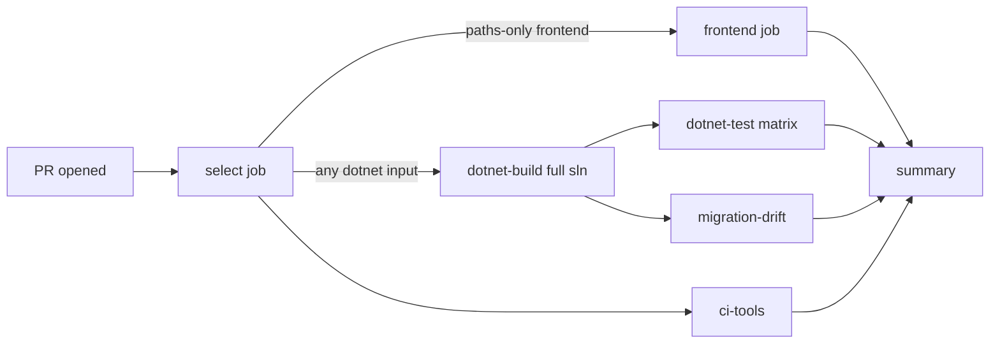

# CI: Affected .NET Test Selection & Pre-Push Format Gate

This document describes PrintFarmer's CI strategy and the local pre-push
formatting hook that replaced the `dotnet format` step in CI.

Related:

- Workflow: [`.github/workflows/ci.yml`](../.github/workflows/ci.yml)
- Selector script: [`scripts/ci/select-dotnet-tests.sh`](../scripts/ci/select-dotnet-tests.sh)
- Selector tests: [`scripts/ci/tests/test-select-dotnet-tests.sh`](../scripts/ci/tests/test-select-dotnet-tests.sh)
- Pre-push hook: [`.githooks/pre-push`](../.githooks/pre-push)
- Pre-push hook tests: [`.githooks/tests/test-pre-push.sh`](../.githooks/tests/test-pre-push.sh)
- Hook installer: [`.githooks/setup.sh`](../.githooks/setup.sh)

---

## Overview



Every PR triggers `select` and `ci-tools`. The selector classifies changed
paths and emits outputs consumed by the conditional jobs. This produces a
required, stable check name even when no application build runs, such as a
docs-only PR.

## Jobs

| Job              | Runs when                                                    | Notes                                                                 |
| ---------------- | ------------------------------------------------------------ | --------------------------------------------------------------------- |
| `select`         | always                                                       | Classifies changed paths; emits `want_*`, `matrix`, `mig_matrix`.     |
| `ci-tools`       | always                                                       | Runs `bash -n` + selector + hook tests; gates changes to selector.    |
| `frontend`       | React inputs changed OR full-safe                            | `npm ci`, lint, build, `npm run test:coverage` in `src/Web/ReactApp/`. |
| `dotnet-build`   | any .NET input changed OR full-safe                          | `dotnet restore && dotnet build` on the whole solution.               |
| `migration-drift`| App or Slicer schema-relevant inputs changed OR full-safe    | `has-pending-model-changes` per provider (App×Pg/SqlServer, Slicer×Pg/SqlServer). |
| `dotnet-test`    | .NET test-relevant inputs changed OR full-safe               | **Matrix** — one leg per affected test project.                       |
| `summary`        | always (`if: always()`)                                      | Aggregates gates; hard-fails on required check regression.            |

## Selection logic (selector script)

`scripts/ci/select-dotnet-tests.sh` reads either:

- `CHANGED_FILES_FROM_Z`: path to a NUL-terminated file list (preferred), or
- `CHANGED_FILES`: newline-separated list (used by the workflow's fallback path).

It classifies each path into one of the buckets below and emits selection
outputs on `$GITHUB_OUTPUT`. `--no-renames` is passed on every `git diff`
invocation so that renames decompose to add+delete pairs — both endpoints
classify.

### Bucket → downstream mapping

| Bucket and exact path selector | Frontend | .NET build | .NET tests | Migration drift | Full-safe |
| --- | :---: | :---: | --- | --- | :---: |
| `frontend`: `src/Web/**` | ✓ | | | | |
| `api`: `src/api/**` | | ✓ | `Farm.Web.Api.Tests`, `Farm.Slicer.Module.Tests`, `Farm.Web.IntegrationTests` | `AppPg`, `AppSqlServer` | |
| `infra`: `src/infra/**` | | ✓ | `Farm.Web.Api.Tests`, `Farm.Slicer.Module.Tests`, `Farm.OrcaSlicer.Worker.Tests`, `Farm.Web.IntegrationTests` | `AppPg`, `AppSqlServer` | |
| `backend_core`: `src/backends/Farm.Backend.Plugin.Core/**` | | ✓ | `Farm.Web.Api.Tests`, `Farm.Slicer.Module.Tests`, `Farm.OrcaSlicer.Worker.Tests`, `Farm.Web.IntegrationTests` | | |
| `backend_plugin`: every other `src/backends/**` path (concrete plugin projects) | | ✓ | `Farm.Web.Api.Tests`, `Farm.Web.IntegrationTests` | | |
| `slicer`: `src/slicer/**`, `src/Slicers/**`, `src/worker-shared/**` | | ✓ | `Farm.Web.Api.Tests`, `Farm.Slicer.Module.Tests`, `Farm.OrcaSlicer.Worker.Tests`, `Farm.Web.IntegrationTests` | `SlicerPg`, `SlicerSqlServer` | |
| `orca_worker`: `src/orcaslicer-worker/**` | | ✓ | `Farm.OrcaSlicer.Worker.Tests` | | |
| `migrations_app`: `src/migrations/Farm.Migrations.*/**` | | ✓ | `Farm.Web.Api.Tests`, `Farm.Web.IntegrationTests` | `AppPg`, `AppSqlServer` | |
| `migrations_slcr`: `src/migrations/Farm.Slicer.Migrations.*/**` | | ✓ | `Farm.Web.Api.Tests`, `Farm.Slicer.Module.Tests`, `Farm.Web.IntegrationTests` | `SlicerPg`, `SlicerSqlServer` | |
| `tests_api`: `src/tests/Farm.Web.Api.Tests/**` | | ✓ | `Farm.Web.Api.Tests` | | |
| `tests_slicer`: `src/tests/Farm.Slicer.Module.Tests/**` | | ✓ | `Farm.Slicer.Module.Tests` | | |
| `tests_orca`: `src/tests/Farm.OrcaSlicer.Worker.Tests/**` | | ✓ | `Farm.OrcaSlicer.Worker.Tests` | | |
| `tests_integration`: `src/tests/Farm.Web.IntegrationTests/**` | | ✓ | `Farm.Web.IntegrationTests` | | |
| `tests_other`: every other `src/tests/**` path | ✓ | ✓ | all | all | ✓ |
| `discovery`: `src/discovery/**`, `src/printer-discovery/**` | ✓ | ✓ | all | all | ✓ |
| `settings`: `src/settings/**` | ✓ | ✓ | all | all | ✓ |
| `shared_config`: `global.json`, any `*.sln`, `Directory.Build.*`, `Directory.Packages.props`, `NuGet.Config`, `src/.editorconfig` | ✓ | ✓ | all | all | ✓ |
| `ci_selector`: `.github/workflows/**`, `scripts/ci/**`, `.githooks/**`, `.devcontainer/**` | ✓ | ✓ | all | all | ✓ |
| `unknown_src`: every other `src/**` path | ✓ | ✓ | all | all | ✓ |
| `tools`: `src/tools/**` | | ✓ | | | |
| `docs`: `docs/**`, root `*.md`, `LICENSE*`, root `.editorconfig`, `.gitignore`, `.gitattributes` | | | | | |
| `mobile`: `mobile/**` | | | | | |
| `unclassified`: every other repository path | | | | | |

`ci-tools` is unconditional and therefore runs for every bucket, including
`docs`, `mobile`, and `unclassified`.

### Full-safe (`full_matrix=1`) triggers

- Any of: `shared_config`, `ci_selector`, `unknown_src`, `discovery`, `settings`, `tests_other`, `devcontainer`.
- `workflow_dispatch` event.
- `push` to `main` or `development`.
- Caller sets `FORCE_FULL_SAFE=1`.
- NUL-parse failure of the `_Z` file.
- Git-quoted path detected in newline-form input (non-ASCII name → forces full-safe).

The workflow intentionally has no `push.paths` filter. Every push to `main` or
`development` dispatches CI, and the selector forces full-safe before reading
the changed-path set.

`Farm.Web.IntegrationTests` is invoked as a project-scoped matrix leg, not via
`farm-web.sln`. The selector emits `run_integration=true` for that leg and the
workflow passes `-p:RunIntegrationTests=true` during restore, build, and test so
the project compiles and executes its tests instead of disabling itself.

### Exclusions

- Docker- and external-service-tagged test categories are excluded from ordinary
  PR CI. Reintroduce them by setting `FORCE_FULL_SAFE=1` on the run or opening a
  dedicated on-demand workflow.

## Pre-push format gate

`.githooks/pre-push` replaces the CI `dotnet format` step. It runs
`dotnet format ./farm-web.sln --verify-no-changes` against the **exact
outgoing Git tree** — not your working directory — so local dirty state cannot
poison the check.

### Contract

- Reads Git's push list from stdin (`<local_ref> <local_sha> <remote_ref>
  <remote_sha>\n`).
- For each non-delete ref, computes `.NET`-relevant paths in the outgoing diff:
  - `src/**/*.cs`, `src/**/*.csproj`
  - `src/farm-web.sln`, `src/.editorconfig`, `src/Directory.Build.props|targets`
- If none affected → skip the format run and pass immediately.
- Otherwise, extracts the tip's tree via `git archive | tar -x` into a
  detached temporary directory and runs `dotnet format --verify-no-changes`.
- Successful verifications are cached; subsequent pushes of the same tree
  under the same SDK & formatter version skip the run.

### Cache

Successful verifications are stamped at:

```
$(git rev-parse --git-common-dir)/pre-push-fmt-cache/<key>
```

where `<key>` is:

```
sha256(
  "pre-push-format-v2" ||
  sha256(hook_script) ||
  <tree_sha> ||
  <dotnet --version> ||
  <dotnet format --version>
)
```

Any of these changing invalidates the cache. All five fields must produce a
64-hex digest — empty SDK or formatter version fails the push closed.

### Fail-closed behaviour

- Missing `dotnet` binary → push rejected (`rc=1`).
- Missing `sha256sum`/equivalent → push rejected.
- Missing `src/farm-web.sln` in the outgoing tree → push rejected.
- Empty `dotnet --version` or `dotnet format --version` → push rejected.
- Git-diff failure → push rejected.

### Standard bypass

The hook is enforced by `git push`. The documented Git bypass is:

```bash
git push --no-verify
# or
git push -n
```

This skips all local pre-push hooks (including this one) exactly once, per
Git's design. Use it in genuine emergencies only.

**Local hooks are not server-enforceable.** Anyone can bypass or delete their
copy. CI no longer reruns `dotnet format`, so branch protection enforces the
build/test/drift checks but does not independently enforce formatting.

## Install the hooks

From the repo root:

```bash
.githooks/setup.sh
```

This points `core.hooksPath` at `.githooks/` and marks the hooks executable.
Devcontainer setup calls this on first attach; you only need to run it
manually on host-native checkouts.

## Timing (order-of-magnitude)

Baselines are approximate and depend on runner load, warm caches, and PR size.

| Scenario                                             | Before (single job)          | After (this workflow)          |
| ---------------------------------------------------- | ---------------------------- | ------------------------------ |
| React-only PR                                        | ~20-30 min (built everything) | ~2-3 min (frontend only)       |
| Docs-only PR                                         | ~20-30 min                    | ~1-2 min (select + ci-tools + summary) |
| Single-project .NET change (api or slicer only)      | ~20-30 min                    | ~8-12 min (build + 1 test leg) |
| Two-project .NET change (both test projects)         | ~20-30 min                    | ~10-14 min (build + 2 test legs parallel) |
| Shared config / selector / unknown-path change       | ~20-30 min                    | ~20-30 min (full-safe)         |
| Push to `main` / `development`                       | ~20-30 min                    | ~20-30 min (full-safe)         |

The pre-push hook shifts ~15-90 s of `dotnet format` out of CI onto the
committer's machine — cached after the first successful verification of any
given tree.

## Failure diagnosis

- `select` failed → inspect the "changed paths" section printed to the job
  summary; treat any surprise as a bug in the selector and add a test case in
  `scripts/ci/tests/test-select-dotnet-tests.sh`.
- `ci-tools` failed → the selector or hook tests regressed. Reproduce with
  `bash scripts/ci/tests/test-select-dotnet-tests.sh` and
  `bash .githooks/tests/test-pre-push.sh` locally.
- `dotnet-test` matrix leg failed → per-project `TestResults/*.trx` is uploaded
  as `dotnet-test-results-<project>` artifact. Download and inspect. The
  workflow also asserts that the TRX reports non-zero executed tests, so an
  empty test run is a hard failure rather than a silent pass.
- `migration-drift` failed → `dotnet ef migrations has-pending-model-changes`
  exited non-zero for one or more `context × provider` matrix legs. That exit
  code does **not** uniquely mean "the model drifted"; the same non-zero
  status is also returned for EF Core tooling, design-time context, provider
  loading, or restore/build failures. Inspect the failing leg's `dotnet ef`
  output in the job log: if it reports pending model changes, regenerate the
  affected migration by running (from `src/`, one invocation per affected
  `context × provider` pair):

  ```bash
  DB_PROVIDER=<postgres|sqlserver> dotnet ef migrations add <PascalCaseName> \
    --project ./migrations/<MigrationsProject> \
    --startup-project ./migrations/<MigrationsProject> \
    --context <AppDbContext|SlicerDbContext>
  ```

  where `<MigrationsProject>` is one of `Farm.Migrations.PostgreSQL`,
  `Farm.Migrations.SqlServer`, `Farm.Slicer.Migrations.PostgreSQL`, or
  `Farm.Slicer.Migrations.SqlServer` — the matrix leg's `MATRIX_PROJECT`
  value in the failing job log identifies which one. `AppDbContext` pairs
  with the two `Farm.Migrations.*` projects; `SlicerDbContext` pairs with
  the two `Farm.Slicer.Migrations.*` projects. Commit the generated files
  under `src/migrations/<MigrationsProject>/Migrations/` alongside the
  model change. If instead the log reports a tool / design-time / provider
  / build error, fix that — no new migration is needed.

## Extending

- **New test project**: add a row to `ALL_TEST_PROJECTS` and (as needed) the
  classification map in `select-dotnet-tests.sh`, then add a matching test case
  in the selector suite. Add it to `farm-web.sln` when appropriate, but CI also
  supports required projects that intentionally live outside the solution.
- **New bucket**: extend `classify_path()` and add a case in the selector suite.
- **New full-safe trigger**: extend the trigger switch in `main()` of the
  selector and add a case.
- **Docker/external-service opt-in**: consider a separate workflow triggered
  by `workflow_dispatch` rather than expanding this one.
