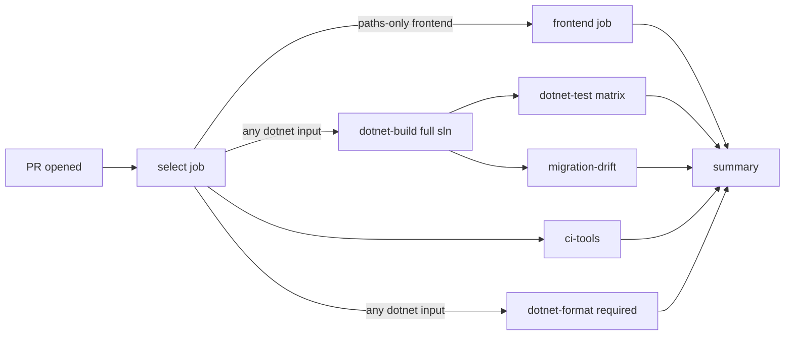

# CI: Affected .NET Test Selection and Formatting Gates

This document describes PrintFarmer's CI strategy, its authoritative
server-side formatting gate, and the supplemental local pre-push check.

Related:

- Workflow: [`.github/workflows/ci.yml`](../.github/workflows/ci.yml)
- Selector script: [`scripts/ci/select-dotnet-tests.sh`](../scripts/ci/select-dotnet-tests.sh)
- Selector tests: [`scripts/ci/tests/test-select-dotnet-tests.sh`](../scripts/ci/tests/test-select-dotnet-tests.sh)
- Pre-push hook: [`.githooks/pre-push`](../.githooks/pre-push)
- Pre-push hook tests: [`.githooks/tests/test-pre-push.sh`](../.githooks/tests/test-pre-push.sh)
- Hook installer: [`.githooks/setup.sh`](../.githooks/setup.sh)

---

## Overview



Every PR triggers the `select` job, which classifies changed paths and emits
outputs consumed by downstream jobs. This produces a required, stable check
name even when no downstream work runs (e.g. docs-only or React-only PRs).

## Jobs

| Job              | Runs when                                                    | Notes                                                                 |
| ---------------- | ------------------------------------------------------------ | --------------------------------------------------------------------- |
| `select`         | always                                                       | Classifies changed paths; emits `want_*`, `matrix`, `mig_matrix`.     |
| `ci-tools`       | always                                                       | Runs `bash -n` + selector + hook tests; gates changes to selector.    |
| `frontend`       | React inputs changed OR full-safe                            | `npm ci`, lint, build, test with coverage in `src/Web/ReactApp/`.     |
| `dotnet-build`   | any .NET input changed OR full-safe                          | `dotnet restore && dotnet build` on the whole solution.               |
| `dotnet-format`  | any .NET input changed OR full-safe                          | Authoritative server-side `dotnet format --verify-no-changes` gate.   |
| `migration-drift`| App or Slicer schema-relevant inputs changed OR full-safe    | `has-pending-model-changes` per provider (App×Pg/SqlServer, Slicer×Pg/SqlServer). |
| `dotnet-test`    | .NET test-relevant inputs changed OR full-safe               | **Matrix** — one leg per affected test project.                       |
| `summary`        | always (`if: always()`)                                      | Aggregates gates; hard-fails on required check regression.            |

## Selection logic (selector script)

`scripts/ci/select-dotnet-tests.sh` reads either:

- `CHANGED_FILES_FROM_Z`: path to a NUL-terminated file list (preferred), or
- `CHANGED_FILES`: newline-separated list (used by the workflow's fallback path).

It classifies each path into one of the buckets below and emits selection
outputs on `$GITHUB_OUTPUT`. `--no-renames` is passed on every `git diff`
invocation so that renames decompose to add+delete pairs — both endpoints
classify.

### Bucket → downstream mapping

| Bucket                                        | want_frontend | want_dotnet_build | want_dotnet_test | want_mig_drift | full_matrix | Notes                              |
| --------------------------------------------- | :-----------: | :---------------: | :--------------: | :------------: | :---------: | ---------------------------------- |
| `frontend` (`src/Web/ReactApp/**`)            | ✓             |                   |                  |                |             | React-only PRs run zero .NET.      |
| `api` (`src/api/**`)                          |               | ✓                 | Api, Slicer, Integration | App drift ✓  |             |                                    |
| `infra` (`src/infra/**`)                      |               | ✓                 | Api, Slicer, Integration | App drift ✓  |             | AppDbContext lives under `src/infra/Data`; both App providers are checked. |
| `backends` (`src/backends/**`)                |               | ✓                 | Api.Tests only                        |                |             | Slicer.Tests does not ref backends.|
| `slicer` (`src/slicer/**`, `src/Slicers/**`, `src/worker-shared/**`) |    | ✓ | Api, Slicer, Integration | Slicer drift ✓ |             |                                    |
| `orca_worker` (`src/orcaslicer-worker/**`) | | ✓ | Orca worker | | | The worker test project is built and tested directly outside the solution. |
| `migrations_app` (`src/migrations/Farm.Migrations.*/**`)             |    | ✓ | Api.Tests               | App drift ✓  |             |                                    |
| `migrations_slcr` (`src/migrations/Farm.Slicer.Migrations.*/**`)     |    | ✓ | Slicer.Tests            | Slicer drift ✓ |             |                                    |
| `tests_api` (`src/tests/Farm.Web.Api.Tests/**`)      |               | ✓                 | Api.Tests             |                |             |                                    |
| `tests_slicer` (`src/tests/Farm.Slicer.Module.Tests/**`) |            | ✓                 | Slicer.Tests          |                |             |                                    |
| `tests_orca` (`src/tests/Farm.OrcaSlicer.Worker.Tests/**`) | | ✓ | Orca worker | | | Direct project coverage outside the solution. |
| `tests_integration` (`src/tests/Farm.Web.IntegrationTests/**`) | | ✓ | Integration | | | Passes `RunIntegrationTests=true` through restore, build, and test; Docker categories remain excluded. |
| `tests_other` (any future unmapped `src/tests/**`) | | ✓ | full matrix ✓ | full ✓ | ✓ | Unknown test projects fail safe. |
| `discovery` (`src/discovery/**`), `settings` (`src/settings/**`) |    | ✓ | full ✓                | full ✓          | ✓          | Foundational; full-safe. |
| `shared_config` (`VERSION`, SDK/tool manifests, solutions, package files, `.editorconfig`, and any `.props`/`.targets`) |   | ✓ | Api, Slicer, Orca, Integration | full ✓ | ✓ | Config/graph inputs affect everything. |
| `ci_selector` (workflows/.githooks/scripts/ci changes)               |    | ✓                 | full ✓                | full ✓          | ✓          | CI/selector edits verify themselves against everything. |
| `unknown_src` (`src/**` didn't match any bucket)                     |    | ✓                 | full ✓                | full ✓          | ✓          | Fail-safe.                          |
| `docs_only`, `mobile`, `tools_only`                                  |    |                   |                       |                 |             | Nothing changes downstream.         |

### Full-safe (`full_matrix=1`) triggers

- Any of: `shared_config`, `ci_selector`, `unknown_src`, `discovery`,
  `settings`, an unmapped `tests_other`, or `devcontainer`.
- `workflow_dispatch` event.
- `push` to `main` or `development`.
- Caller sets `FORCE_FULL_SAFE=1`.
- NUL-parse failure of the `_Z` file.
- Git-quoted path detected in newline-form input (non-ASCII name → forces full-safe).

### Exclusions

- Docker- and external-service-tagged test categories are excluded from both
  scoped and full-safe runs. Run those categories out-of-band in an environment
  that provides their required services.

## Pre-push format gate

`.githooks/pre-push` supplements the required CI formatting job. It verifies
the **exact outgoing Git tree** rather than the working directory, so local
dirty state cannot poison the check.

### Contract

- Reads Git's push list from stdin (`<local_ref> <local_sha> <remote_ref>
  <remote_sha>\n`).
- For each non-delete ref, computes `.NET`-relevant paths in the outgoing diff:
  source/project/solution files, `VERSION`, `global.json`, `dotnet-tools.json`,
  NuGet/package lock files, `.editorconfig`, and any `.props`/`.targets`.
- If none affected → skip the format run and pass immediately.
- Otherwise, extracts the tip's tree via `git archive | tar -x` into a
  detached temporary directory. SDK and formatter identity are probed only
  there. On a cache miss it explicitly restores the solution using the normal
  machine-wide NuGet package cache, then runs
  `dotnet format --verify-no-changes --no-restore`.
- Successful verifications are cached; subsequent pushes of the same tree
  under the same SDK & formatter version skip the run.

### Cache

Successful verifications are stamped at:

```
$(git rev-parse --git-common-dir)/pre-push-fmt-cache/<key>
```

where `<key>` is:

```
sha256(
  "pre-push-format-v2" ||
  sha256(hook_script) ||
  <tree_sha> ||
  <dotnet --version> ||
  <dotnet format --version>
)
```

Any of these changing invalidates the cache. All five fields must produce a
64-hex digest — empty SDK or formatter version fails the push closed.

### Fail-closed behaviour

- Missing `dotnet` binary → push rejected (`rc=1`).
- Missing `sha256sum`/equivalent → push rejected.
- Missing `src/farm-web.sln` in the outgoing tree → push rejected.
- Empty `dotnet --version` or `dotnet format --version` → push rejected.
- Git-diff failure → push rejected.

### Standard bypass

The hook is enforced by `git push`. The documented Git bypass is:

```bash
git push --no-verify
# or
git push -n
```

This skips all local pre-push hooks (including this one) exactly once, per
Git's design. Use it in genuine emergencies only.

**Local hooks are not server-enforceable.** Anyone can bypass or delete their
copy. The authoritative gate is CI's `.NET format` job, whose result is a
required dependency of the always-created `CI summary` check.

## Install the hooks

From the repo root:

```bash
.githooks/setup.sh
```

This points `core.hooksPath` at `.githooks/` and marks the hooks executable.
Devcontainer setup calls this on first attach; you only need to run it
manually on host-native checkouts.

## Timing (order-of-magnitude)

Baselines are approximate and depend on runner load, warm caches, and PR size.

| Scenario                                             | Before (single job)          | After (this workflow)          |
| ---------------------------------------------------- | ---------------------------- | ------------------------------ |
| React-only PR                                        | ~20-30 min (built everything) | ~2-3 min (frontend only)       |
| Docs-only PR                                         | ~20-30 min                    | ~30 s (select + summary only)  |
| API or slicer .NET change                            | ~20-30 min                    | ~10-14 min (build + 3 test legs parallel) |
| Orca worker or direct test-project change            | ~20-30 min                    | ~8-12 min (build + affected test leg) |
| Shared config / selector / unknown-path change       | ~20-30 min                    | ~20-30 min (full-safe)         |
| Push to `main` / `development`                       | ~20-30 min                    | ~20-30 min (full-safe)         |

The pre-push hook adds early local feedback without weakening CI. Its restore
and format work is skipped after the first successful verification of a given
tree/SDK/formatter identity, while CI still verifies formatting independently.

## Failure diagnosis

- `select` failed → inspect the "changed paths" section printed to the job
  summary; treat any surprise as a bug in the selector and add a test case in
  `scripts/ci/tests/test-select-dotnet-tests.sh`.
- `ci-tools` failed → the selector or hook tests regressed. Reproduce with
  `bash scripts/ci/tests/test-select-dotnet-tests.sh` and
  `bash .githooks/tests/test-pre-push.sh` locally.
- `dotnet-test` matrix leg failed → per-project `TestResults/*.trx` is uploaded
  as `trx-<project>` artifact. Download and inspect. The workflow also asserts
  that the TRX reports non-zero executed tests, so an empty test run is a hard
  failure rather than a silent pass.
- `migration-drift` failed → the model on your branch drifted from the last
  migration. Regenerate migrations per [Migrations](../src/migrations/README.md)
  and commit them.

## Extending

- **New test project**: add a row to `ALL_TEST_PROJECTS` and the classification
  map in `select-dotnet-tests.sh`, then add a matching selector test. Add it to
  `farm-web.sln` when appropriate, but CI also supports required projects that
  intentionally live outside the solution.
- **New bucket**: extend `classify_path()` and add a case in the selector suite.
- **New full-safe trigger**: extend the trigger switch in `main()` of the
  selector and add a case.
- **Docker/external-service opt-in**: consider a separate workflow triggered
  by `workflow_dispatch` rather than expanding this one.
