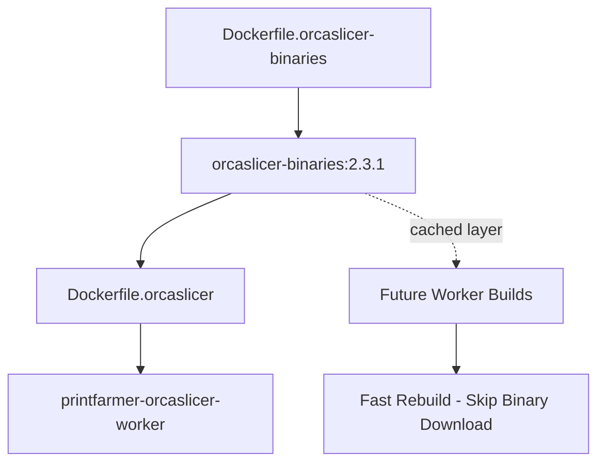

# OrcaSlicer Binary Layer Optimization

This document describes the optimized Docker build strategy for OrcaSlicer worker containers that separates binary assets from application code for improved build performance.

## Problem

The original OrcaSlicer worker Dockerfile downloaded and extracted large AppImage binaries (~200MB+) every time the container was rebuilt, even for minor code changes. This resulted in:

- Long build times (5-10+ minutes for binary download/extraction)
- Unnecessary bandwidth usage
- Poor developer experience during development cycles
- Inefficient CI/CD pipeline performance

## Solution

We've split the build into two optimized layers:

1. **Binary Layer** (`Dockerfile.orcaslicer-binaries`) - Downloads and extracts OrcaSlicer binaries once
2. **Worker Layer** (`Dockerfile.orcaslicer`) - Contains application code and uses cached binaries

## Architecture



## Files

- **Canonical Dockerfile Location**

  The canonical Dockerfile sources for OrcaSlicer are maintained under:

  - `scripts/docker/dockerfiles/`

  This directory contains authoritative Dockerfiles and fragments such as `Dockerfile.orcaslicer-binaries` and `Dockerfile.orcaslicer`.

  Prefer using the generator utility `scripts/docker/dockerfile-generator.sh --generate-config` to emit a working Dockerfile in your current directory prior to running `docker build`. This centralizes maintenance and avoids accidental divergence between copies.

- **`Dockerfile.orcaslicer-binaries`** - Binary-only layer with optimized extraction logic (canonical copy under `scripts/docker/dockerfiles/`)
- **`Dockerfile.orcaslicer`** - Modified worker Dockerfile using cached binaries (canonical copy under `scripts/docker/dockerfiles/`)
- **`build-orcaslicer-optimized.sh`** - Build script demonstrating optimal workflow
- **`docker-compose.yml`** - Updated with binary layer service

## Usage

### Option 1: Build Script (Recommended)

```bash
# Build both layers optimally
./build-orcaslicer-optimized.sh

# Build with specific version
ORCASLICER_VERSION=2.3.1 ./build-orcaslicer-optimized.sh

# Build with GitHub token (avoid rate limits)
GITHUB_TOKEN=your_token ./build-orcaslicer-optimized.sh
```

### Option 2: Manual Docker Commands (preferred via generator)

The canonical Dockerfiles live in `scripts/docker/dockerfiles/`. Use the generator to emit a merged or copied Dockerfile into your working directory and then run the normal `docker build` command.

```bash
# Generate a Dockerfile in the current directory based on deploy-like flags
./scripts/docker/dockerfile-generator.sh --generate-config \
  --architecture amd64 \
  --enable-orca-worker yes \
  --include-monitoring no \
  --out ./Dockerfile.orcaslicer-binaries

# Step 1: Build binary layer (slow, but cached)
docker build -f Dockerfile.orcaslicer-binaries \
  -t orcaslicer-binaries:2.3.1 \
  --build-arg ORCASLICER_VERSION=2.3.1 \
  .

# Step 2: Build worker (fast, uses cached binaries)
docker build -f Dockerfile.orcaslicer \
  -t printfarmer-orcaslicer-worker \
  --build-arg ORCASLICER_VERSION=2.3.1 \
  .
```

If you prefer the legacy approach, the canonical files are available at `scripts/docker/dockerfiles/Dockerfile.orcaslicer-binaries` and can be copied manually. The generator approach is recommended for reproducibility and to ensure you get the correct merged fragments for the selected configuration.

### Option 3: Docker Compose

```bash
# Build binary layer first
docker compose --profile orca-binaries build orcaslicer-binaries

# Build worker (depends on binary layer)
docker compose --profile orca build orcaslicer-worker
```

## Performance Benefits

| Scenario | Before | After | Improvement |
|----------|--------|-------|-------------|
| First build | 8-12 min | 8-12 min | Same |
| Code-only rebuild | 8-12 min | 2-3 min | **60-75% faster** |
| CI/CD pipeline | 8-12 min per build | 2-3 min after cache | **Significant** |

## Development Workflow

For active development where you're frequently rebuilding the worker:

```bash
# Initial setup (once)
./build-orcaslicer-optimized.sh

# During development (fast rebuilds)
docker build -f Dockerfile.orcaslicer -t printfarmer-orcaslicer-worker .

# Only rebuild binaries when OrcaSlicer version changes
ORCASLICER_VERSION=2.4.0 docker build -f Dockerfile.orcaslicer-binaries -t orcaslicer-binaries:2.4.0 .
```

## Build Arguments

### Binary Layer (`Dockerfile.orcaslicer-binaries`)

- **`ORCASLICER_VERSION`** - Version to download (default: 2.3.1)
- **`ORCASLICER_URL`** - Override download URL (optional)
- **`ALLOW_STUB`** - Create stub binary if download fails (default: true)
- **`GITHUB_TOKEN`** - GitHub API token for rate limit avoidance (optional)

### Worker Layer (`Dockerfile.orcaslicer`)

- **`ORCASLICER_VERSION`** - Must match binary layer version

## Version Management

Binary layers are tagged with versions for easy management:

```bash
# List available binary layers
docker images orcaslicer-binaries

# Build specific versions
docker build -f Dockerfile.orcaslicer-binaries -t orcaslicer-binaries:2.3.1 --build-arg ORCASLICER_VERSION=2.3.1 .
docker build -f Dockerfile.orcaslicer-binaries -t orcaslicer-binaries:2.4.0 --build-arg ORCASLICER_VERSION=2.4.0 .

# Use specific version in worker
docker build -f Dockerfile.orcaslicer -t worker:2.3.1 --build-arg ORCASLICER_VERSION=2.3.1 .
```

## CI/CD Integration

In CI/CD pipelines, build and cache the binary layer separately:

```yaml
# Example GitHub Actions
- name: Build Binary Layer
  run: |
    docker build -f Dockerfile.orcaslicer-binaries \
      -t orcaslicer-binaries:${{ env.ORCASLICER_VERSION }} \
      --cache-from orcaslicer-binaries:latest \
      .

- name: Build Worker (Fast)
  run: |
    docker build -f Dockerfile.orcaslicer \
      -t printfarmer-orcaslicer-worker \
      .
```

## Troubleshooting

### Binary layer build fails
- Check network connectivity to GitHub
- Verify ORCASLICER_VERSION exists in releases
- Use GITHUB_TOKEN to avoid rate limits
- Check build logs for specific extraction errors

### Worker build can't find binary layer
- Ensure binary layer is built first: `docker images orcaslicer-binaries`
- Verify version match between layers
- Check ORCASLICER_VERSION build arg

### Performance not improved
- Verify you're rebuilding worker only, not binary layer
- Check Docker layer caching is enabled
- Ensure binary layer tag matches worker FROM statement

## Microservice Architecture Integration

The binary layer optimization has been integrated across all microservice deployment configurations:

### Updated Files
- **`docker-compose.yml`** - Main deployment configuration
- **`docker-compose.microservices.yml`** - Microservices architecture
- **`docker-compose.host-network.yml`** - Host network configuration
- **`scripts/deploy-docker.sh`** - Production deployment script
- **`scripts/start-all-local-with-workers.sh`** - Local development script
- **`scripts/build-orcaslicer-amd64.sh`** - Cross-platform build script

### Deployment Commands

**Microservices Architecture:**
```bash
# Build binary layer
docker compose -f docker-compose.microservices.yml --profile orca-binaries build orcaslicer-binaries

# Build and run OrcaSlicer worker
docker compose -f docker-compose.microservices.yml --profile orca up orcaslicer-worker
```

**Host Network Mode:**
```bash
# Build binary layer
docker compose -f docker-compose.host-network.yml --profile orca-binaries build orcaslicer-binaries

# Build and run OrcaSlicer worker
docker compose -f docker-compose.host-network.yml --profile orca up orcaslicer-worker
```

**Production Deployment:**
```bash
# Uses optimized binary layer automatically
ENABLE_ORCA_WORKER=yes ./scripts/deploy-docker.sh
```

## Migration from Old Approach

To migrate existing deployments:

1. **Update compose files**: Already updated with binary layer services
2. **Rebuild with optimization**: `./build-orcaslicer-optimized.sh`
3. **Update CI/CD scripts**: Modified deployment scripts use new approach
4. **Clean old images**: `docker rmi orcaslicer-assets:local` (optional)
5. **Update team workflows**: Use new build commands above

## Technical Details

The binary layer uses:
- Multi-stage build with `FROM scratch` for minimal final size
- Comprehensive AppImage extraction with multiple fallback methods
- Smart GitHub API discovery for download URLs
- Build secrets support for preseeded AppImages
- Version-specific tagging strategy for cache management