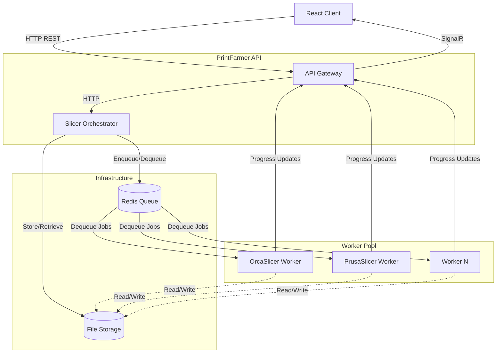
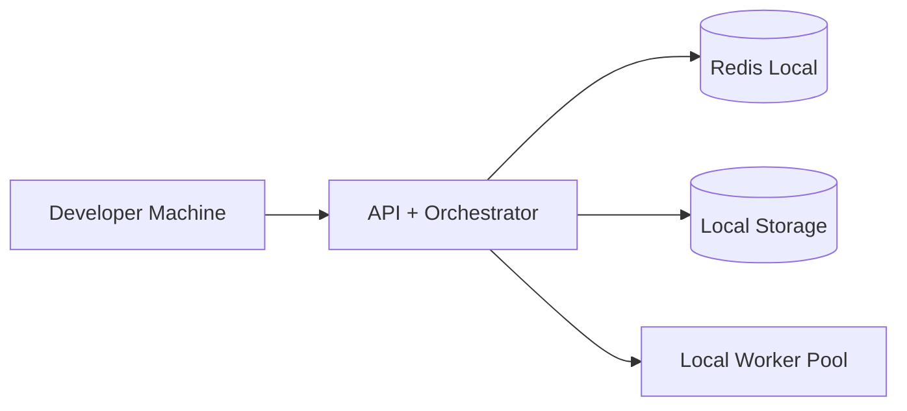
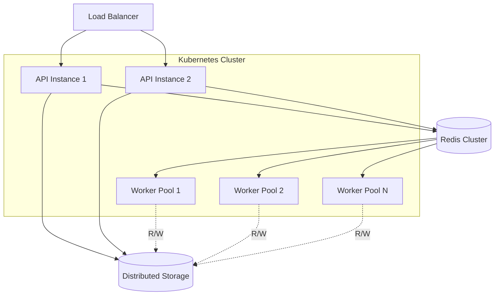
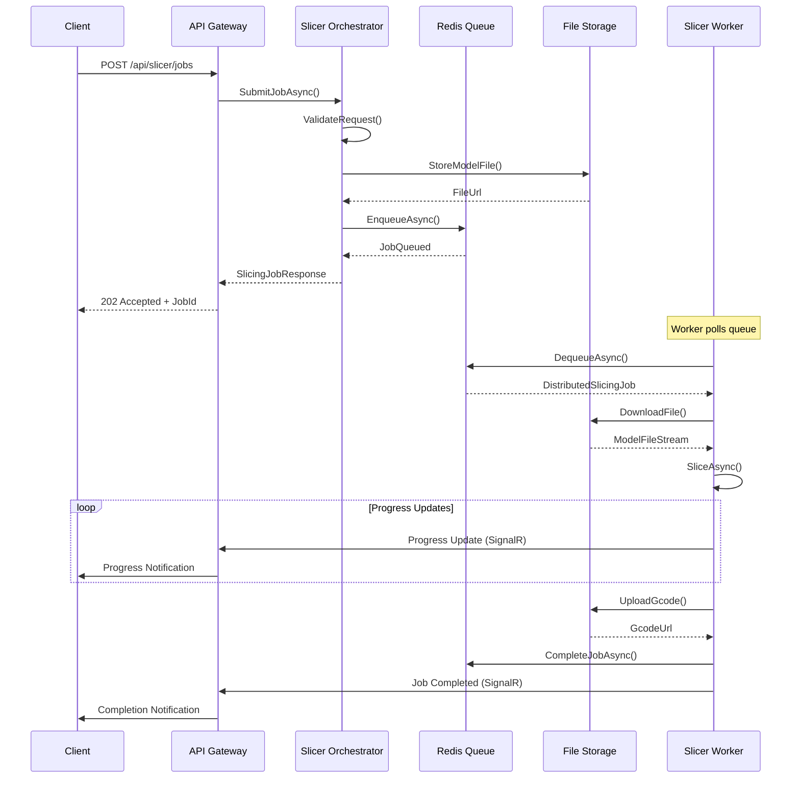
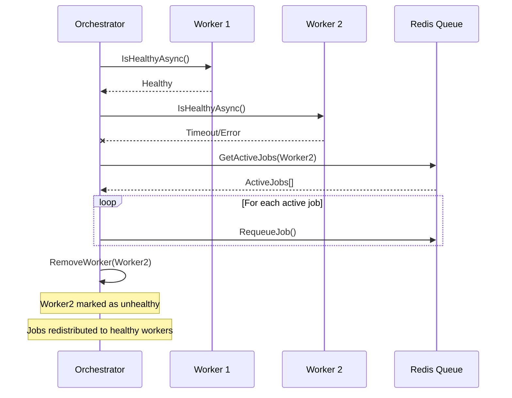
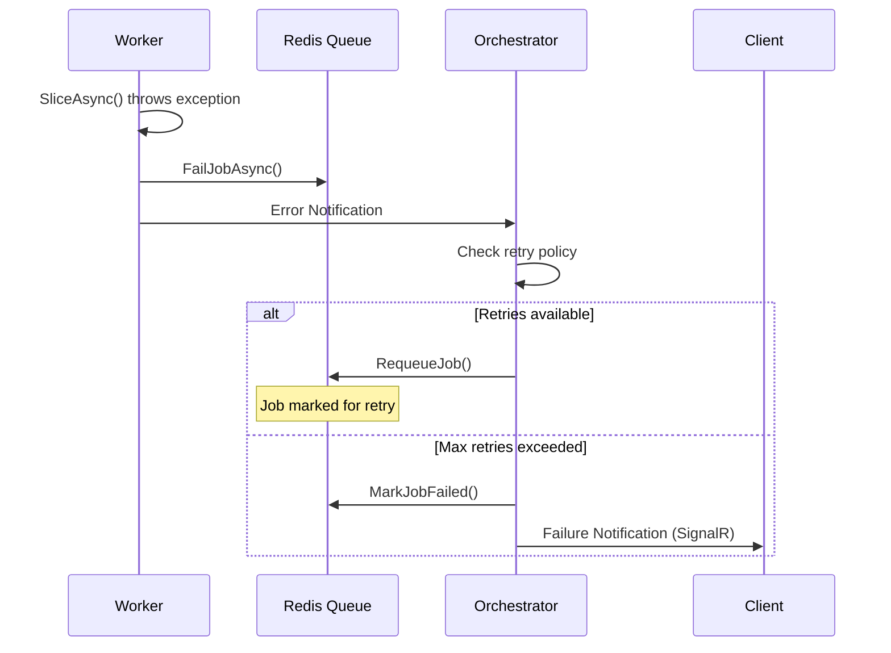

# Slicer Microservices Architecture

## Context

PrintFarmer's slicer microservices architecture enables distributed processing of 3D model files into printer-ready G-code. This system supports multiple slicer engines (OrcaSlicer, PrusaSlicer, etc.) running as independent workers, coordinated through a central orchestrator with Redis-based job queuing and real-time progress updates via SignalR.

## Business Requirements

- **Scalability**: Support horizontal scaling of slicer workers to handle varying workloads
- **Reliability**: Ensure job persistence and recovery in case of worker failures  
- **Multi-Engine Support**: Enable different slicer engines (OrcaSlicer, PrusaSlicer, Cura) simultaneously
- **Real-Time Feedback**: Provide live progress updates to users during slicing operations
- **Resource Efficiency**: Optimize CPU and memory usage across distributed workers
- **Storage Management**: Handle large model files and generated G-code efficiently

## Architecture Overview

The slicer microservices architecture consists of five core components:



### Component Responsibilities

1. **API Gateway (ASP.NET Core API)**
   - Expose REST endpoints for job submission and status queries
   - Handle authentication and authorization
   - Manage SignalR hubs for real-time notifications

2. **Slicer Orchestrator (Dispatcher)**
   - Coordinate job lifecycle from submission to completion
   - Validate job requests and model files
   - Manage worker health and capacity
   - Implement retry logic and error handling

3. **Redis Queue**
   - Persist job state and metadata
   - Provide priority-based job scheduling
   - Enable atomic job dequeuing for workers
   - Support job timeout and retry mechanisms

4. **File Storage (Local/Cloud)**
   - Store input model files and output G-code
   - Manage temporary working directories for workers
   - Provide secure file access with expiring URLs

5. **Slicer Workers**
   - Execute actual slicing operations using specific engines
   - Report progress and status updates
   - Handle worker registration and health checks
   - Support graceful shutdown and job handover

## Deployment Architecture

### Development Environment


### Production Environment  


## Sequence Diagrams

### Job Submission Flow


### Worker Health Check Flow


### Error Handling Flow


## Key Design Decisions

See individual ADRs for detailed decision rationale:

- **[Queue Technology](queue-choice.md)**: Redis selected for persistence, performance, and operational simplicity
- **[Storage Strategy](storage-choice.md)**: Local file system with cloud storage abstraction for flexibility  
- **[Communication Protocol](comms-protocol.md)**: HTTP REST + SignalR for request/response and real-time updates

## Scalability Characteristics

### Horizontal Scaling
- **API Instances**: Stateless design enables load balancing across multiple API instances
- **Worker Pool**: Independent workers can be added/removed dynamically based on queue depth
- **Redis Clustering**: Supports Redis Cluster for high availability and performance
- **Storage**: File storage can scale independently using distributed storage solutions

### Performance Metrics
- **Queue Throughput**: Redis supports 100K+ operations/second
- **File Upload/Download**: Limited by network bandwidth and storage I/O
- **Worker Efficiency**: CPU-bound slicing operations scale linearly with worker count
- **Real-time Updates**: SignalR backplane supports thousands of concurrent connections

## Monitoring and Observability

### Health Checks
```csharp
// Orchestrator health endpoint returns:
{
  "isHealthy": true,
  "jobQueueHealthy": true, 
  "fileStorageHealthy": true,
  "engines": {
    "OrcaSlicer": {
      "isHealthy": true,
      "activeWorkers": 3,
      "queueDepth": 12,
      "avgProcessingTime": "00:05:30"
    }
  }
}
```

### Key Metrics
- **Queue Depth**: Number of pending jobs per slicer type
- **Worker Utilization**: Active workers vs. total capacity
- **Job Success Rate**: Completed vs. failed jobs over time
- **Processing Times**: Average and P95 latency by file size/complexity
- **Storage Usage**: Disk space utilization and cleanup efficiency

### Distributed Tracing
- Correlation IDs track jobs across all components
- OpenTelemetry integration for request tracing
- Centralized logging with structured JSON format

## Security Considerations

### Authentication & Authorization
- JWT-based authentication for API access
- Role-based authorization for job submission
- Worker authentication via shared secrets or certificates

### File Security
- Temporary signed URLs for file access
- Automatic cleanup of expired files
- Virus scanning integration for uploaded models
- Input validation and size limits

### Network Security  
- TLS encryption for all HTTP communications
- Redis AUTH for queue access
- Network segmentation between components
- Rate limiting on job submission endpoints

## Operational Procedures

### Deployment
1. Deploy Redis cluster with persistence enabled
2. Set up file storage with appropriate permissions
3. Deploy API instances behind load balancer
4. Scale worker pools based on expected load
5. Configure monitoring and alerting

### Maintenance
- **Queue Cleanup**: Automated removal of completed jobs older than 30 days
- **Storage Cleanup**: Cleanup of orphaned files and temporary directories  
- **Worker Updates**: Rolling deployment of worker updates without job loss
- **Scaling**: Auto-scaling based on queue depth and worker utilization

### Disaster Recovery
- **Redis Backup**: Point-in-time recovery with RDB snapshots
- **File Backup**: Regular backup of critical model files and configurations
- **Job Recovery**: Automatic requeuing of in-progress jobs after failures
- **Cross-Region**: Support for multi-region deployment for disaster recovery

## Future Enhancements

### Short Term (Next 6 months)
- **Auto-scaling**: Dynamic worker scaling based on queue metrics
- **Advanced Scheduling**: Priority queues and resource-aware job assignment
- **Batch Processing**: Support for bulk slicing operations
- **Enhanced Monitoring**: Custom Grafana dashboards and alerting rules

### Long Term (6-18 months)  
- **Multi-Tenancy**: Isolated slicing environments per user/organization
- **ML Integration**: Intelligent slicing parameter optimization
- **Edge Computing**: Distributed slicing on user-premises hardware
- **Advanced Storage**: Integration with object storage (S3, Azure Blob)

## References

- [Redis Documentation](https://redis.io/documentation)
- [SignalR Documentation](https://docs.microsoft.com/en-us/aspnet/signalr/)
- [ASP.NET Core Architecture](https://docs.microsoft.com/en-us/aspnet/core/)
- [Microservices Patterns](https://microservices.io/patterns/)
- [PrintFarmer Deployment Architectures](../../DEPLOYMENT_ARCHITECTURES.md)